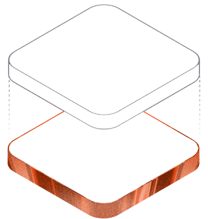
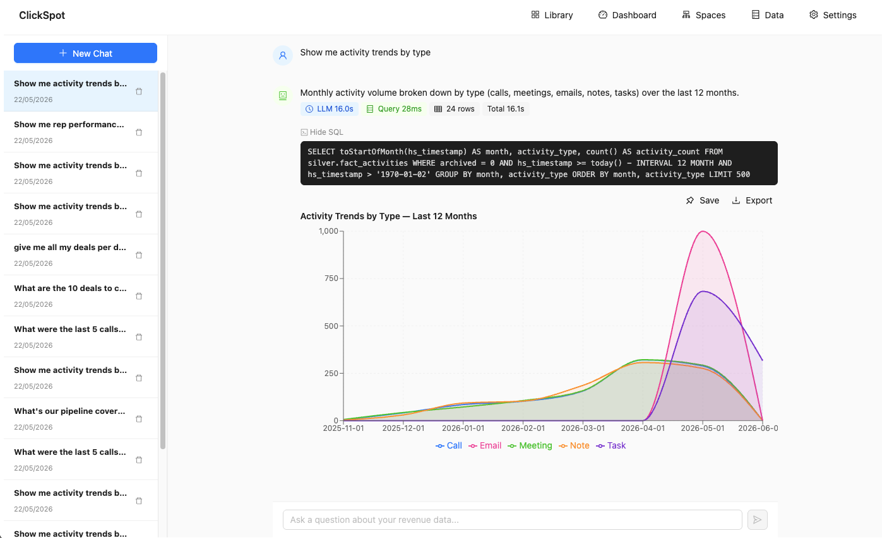
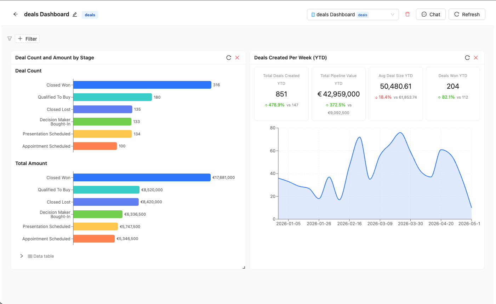
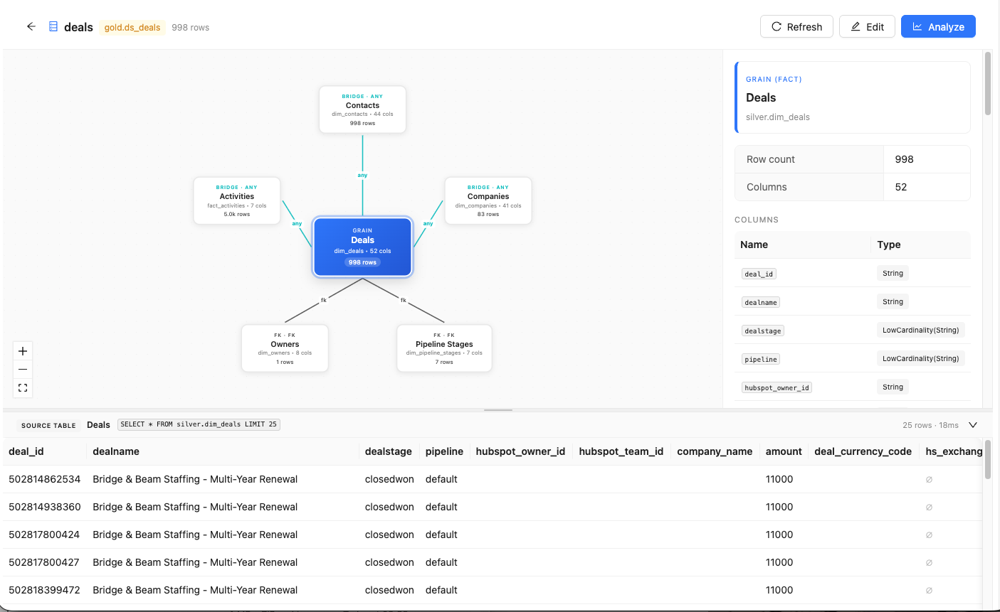
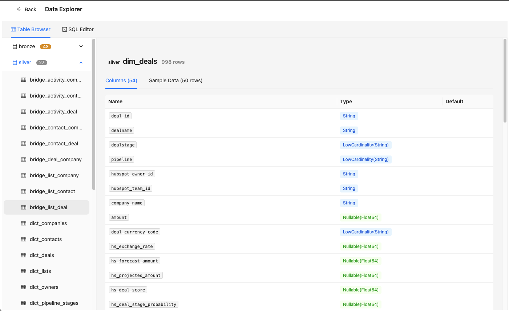
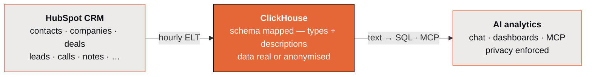
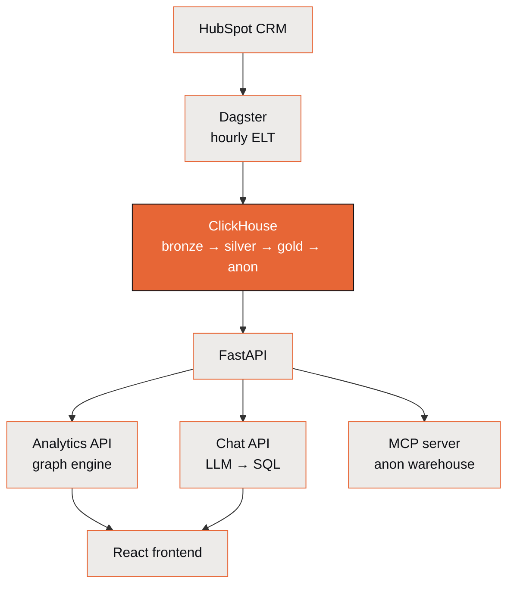

<div align="center">



# ClickSpot

**Ask your HubSpot CRM questions in plain English — get back SQL, charts, and dashboards.**

[](LICENSE)
[](pyproject.toml)
[](frontend/package.json)
[](docker-compose.yml)

[Quick start](#quick-start) · [What it does](#what-it-does) · [Architecture](#architecture) · [Configuration](#configuration) · [Docs](#documentation)

</div>

<p align="center">
  
</p>

<p align="center"><sub>Real UI, synthetic demo data — no customer CRM or PII.</sub></p>

<p align="center">
  <a href="https://youtu.be/fJtDndTOIpA"><strong>▶&nbsp; Watch the demo</strong></a>
</p>

ClickSpot extracts HubSpot CRM data hourly via Dagster, transforms it through a bronze/silver/gold medallion architecture in ClickHouse, and serves it through a chat interface where natural-language questions are converted to ClickHouse SQL by an LLM.

**Who it's for:** RevOps, sales-ops, and data teams who live in HubSpot and want a queryable warehouse plus a natural-language layer over their CRM — without standing up the pipeline themselves.

### Highlights

- 💬 **NL → SQL chat** — ask in plain English; an LLM writes the ClickHouse SQL and returns a chart, table, or number. The LLM only sees schema, never your data.
- 📊 **Dashboards** — pin chat results and apply global filters (date, owner, pipeline) via rule-based SQL rewriting — no AI at query time.
- 🗂️ **Data Spaces** — scoped, configured views over the warehouse, each with its own chat, dashboards, and filters.
- 🕸️ **Associative engine** — Qlik-style selection propagation: pick a value anywhere and connected tables filter automatically.
- 🔌 **MCP server** — exposes the anonymized warehouse to Claude Desktop / other MCP clients with the same guardrails as in-app chat.
- 🏗️ **Medallion ELT** — bronze → silver → gold → anon, orchestrated by Dagster with atomic rebuilds.

### See it in action

|  |  |  |
|:---:|:---:|:---:|
| <a href="docs/assets/screenshots/dashboard-deals.png"></a> | <a href="docs/assets/screenshots/explorer-associative.png"></a> | <a href="docs/assets/screenshots/explorer-schema.png"></a> |
| **Dashboards** — pinned results, global filters | **Associative engine** — Qlik-style selection | **Medallion schema** — bronze → silver, typed |

---

## Contents

- [What it does](#what-it-does)
- [Quick start](#quick-start)
- [Architecture](#architecture)
- [Stack](#stack)
- [Configuration](#configuration)
- [Development](#development)
- [Documentation](#documentation)
- [Stats](#stats)
- [License](#license)

---

## What it does

1. **Extracts** contacts, companies, deals, leads, activities, pipelines, and associations from HubSpot's CRM API
2. **Loads** raw data into ClickHouse bronze tables (full list-endpoint loads, deduplicated)
3. **Transforms** into typed silver dimensions, facts, and bridge tables (config-driven)
4. **Aggregates** into gold tables for rep performance, deal health, source attribution, and pipeline snapshots
5. **Anonymizes** silver/gold into `silver_anon`/`gold_anon` databases for safe external sharing (MCP, demos)
6. **Serves** five interfaces:
   - **Chat** — Ask questions in natural language, get SQL + visualizations
   - **Dashboards** — Pin chat results to persistent dashboards with global filters (date, owner, pipeline)
   - **Data Spaces** — Scoped, configured views over the warehouse with per-space chat, dashboards, and filters
   - **Analytics API** — Associative graph engine (Qlik-like selection propagation)
   - **MCP server** — Exposes the anonymized warehouse to Claude Desktop / other MCP clients with the same schema prompt and SQL guardrails as in-app chat

---

## Quick start

### Prerequisites

- Python 3.10+
- Node.js 20.19+
- Docker (for ClickHouse)
- A HubSpot private app token with CRM read scopes

### Setup

```bash
# Clone and enter
cd ClickSpot

# Python environment (Python 3.10+)
python -m venv .venv
source .venv/bin/activate
# Reproducible install from the pinned lockfile (recommended — matches CI):
pip install -r requirements.lock && pip install -e . --no-deps
# Or, for an unpinned dev install resolving the latest compatible versions:
# pip install -e ".[dev]"
#
# Regenerate the lockfile after editing pyproject.toml deps (needs `uv`):
# uv pip compile pyproject.toml --all-extras --python-version 3.10 \
#   --generate-hashes --output-file requirements.lock

# Environment
cp .env.example .env
# Edit .env: set HUBSPOT_TOKEN, optionally ANTHROPIC_API_KEY or OPENAI_API_KEY

# Frontend
cd frontend && npm install && cd ..

# Start everything
./start.sh

# (Optional, recommended on first run) walk through portal-specific config:
python -m app.customer.onboarding
```

This starts:

| Service | URL | Purpose |
|---------|-----|---------|
| ClickHouse | http://localhost:8124 | Data warehouse |
| FastAPI | http://localhost:8192 | Backend API |
| Dagster | http://localhost:8194 | Pipeline orchestration |
| Frontend | http://localhost:8193 | Chat, dashboards, data explorer |

### First-time portal setup

ClickSpot ships with no portal-specific assumptions. On first run, three things tune it to your HubSpot account:

1. **`HUBSPOT_TOKEN` + `HUBSPOT_HUB_ID`** in `.env` — required for bronze extraction and HubSpot record URLs.
2. **`~/.clickspot/customer.json`** — your portal's pipeline names, stages, currency, company name. Auto-discovered from silver tables on the first successful run, then editable. Override via the onboarding wizard (`python -m app.customer.onboarding`) or by hand.
3. **`silver_config_custom.py`** (optional, gitignored) — for non-standard HubSpot properties on your portal (e.g. ARR-specific deal amounts, custom dropdowns). Copy `silver_config_custom.py.example` and add tuples for the properties you want in silver. The onboarding wizard can also auto-suggest these by scanning `/crm/v3/properties/{deals,contacts}`.

If neither file exists, the chat still works — it just produces generic SQL without portal-specific filters.

### First run

1. Open Dagster at http://localhost:8194
2. Materialize all assets (or wait for the hourly schedule)
3. Open the frontend at http://localhost:8193
4. Configure an LLM provider in Settings (top-right)
5. Ask a question: *"What's our pipeline coverage for this quarter?"*

---

## Architecture

Three stages: pull HubSpot CRM into ClickHouse, then serve it through an AI analytics layer that answers questions in SQL — without ever showing raw data to the model.



### Components

How those stages are wired:



### Data pipeline

Three-layer medallion architecture:

| Layer | Tables | Engine | Strategy |
|-------|--------|--------|----------|
| **Bronze** | 16 objects + 25 associations | `ReplacingMergeTree` (`_raw` ZSTD(3)) | Full list-endpoint loads, deduped on `_record_id` |
| **Silver** | 11 dimensions + 3 facts + 13 bridges + 9 dicts | `ReplacingMergeTree` — partitioned + bloom-filter skip indexes on hot lookups | Full rebuild via `EXCHANGE TABLES` (atomic swap) |
| **Gold** | 7 aggregates | `ReplacingMergeTree` — partitioned where there's a natural date axis | Full rebuild |
| **Anon** | Masked silver + gold mirrors in `silver_anon` / `gold_anon` | `ReplacingMergeTree` | Rebuilt after gold via sensor |

### Chat interface

```
User question
    -> Schema prompt (tables + semantics + business context)
    -> LLM (Claude / GPT-4o)
    -> Structured response {sql, viz, title, explanation, context}
    -> SQL validation (whitelist tables, block mutations)
    -> ClickHouse execution
    -> Chart / table / number rendered inline
```

The LLM never sees actual data — only schema metadata and property descriptions from HubSpot. Queries use relative date expressions (`today()`, `toStartOfMonth()`) so saved results stay current. Period-over-period comparisons show colored delta badges.

### Dashboards

Chat results can be saved to an object library and pinned to persistent dashboards. Each dashboard supports global filters (date range, owner, pipeline) that apply to all cards simultaneously via rule-based SQL rewriting — no AI involved.

```
Dashboard filter state
    -> sqlglot AST parse (ClickHouse dialect)
    -> Identify table references from a static registry
    -> Inject WHERE conditions (silver uses IDs, gold uses names)
    -> Re-execute all card queries
```

### Associative engine

Qlik-inspired selection propagation. Select a value in any table and all connected tables filter automatically through bridge table traversal.

---

## Stack

| Component | Technology |
|-----------|-----------|
| Data warehouse | ClickHouse (columnar OLAP) |
| ETL orchestration | Dagster OSS |
| Backend API | FastAPI (Python) |
| Frontend | React 19 + TypeScript + Ant Design + Recharts + React Grid Layout |
| SQL filter engine | sqlglot (AST-based SQL rewriting for dashboard filters) |
| LLM providers | Claude (Anthropic API / OAuth / CLI), GPT-4o (OpenAI API) |

---

## Configuration

### Environment variables

| Variable | Required | Description |
|----------|----------|-------------|
| `HUBSPOT_TOKEN` | Yes | HubSpot private app token |
| `HUBSPOT_HUB_ID` | Yes | HubSpot portal/hub ID — used to build canonical record URLs for the frontend and MCP responses |
| `HUBSPOT_REGION` | No | Region code (`na1`, `eu1`, `na2`, …) for click-through URL subdomain. Auto-detected from `HUBSPOT_TOKEN` on first bronze call and cached in `~/.clickspot/customer.json`; only set explicitly when running MCP without the token. |
| `CLICKHOUSE_HOST` | Yes | ClickHouse hostname (default: `localhost`) |
| `CLICKHOUSE_PORT` | Yes | ClickHouse HTTP port (default: `8124`) |
| `CLICKHOUSE_USER` | Yes | ClickHouse username (default: `hs2ch`) |
| `CLICKHOUSE_PASSWORD` | Yes | ClickHouse password (default: `hs2ch`) |
| `DAGSTER_HOME` | Recommended | Persistent Dagster storage directory |
| `ANTHROPIC_API_KEY` | Optional | Anthropic API key for Claude |
| `OPENAI_API_KEY` | Optional | OpenAI API key for GPT-4o |

### HubSpot token scopes

ClickSpot reads from HubSpot via a **private app token** (recommended) or a legacy "HubSpot API key" app. Create the token in *Settings → Integrations → Private Apps → Create private app* and grant the read scopes below. All scopes are read-only — the pipeline never writes back to HubSpot.

<details>
<summary><strong>Required read scopes, per endpoint group</strong></summary>

<br/>

| Endpoint group | Used by | Required scope |
|---|---|---|
| Contacts (`/crm/v3/objects/contacts`) | `hs_contacts` bronze + property metadata | `crm.objects.contacts.read`, `crm.schemas.contacts.read` |
| Companies (`/crm/v3/objects/companies`) | `hs_companies` bronze + property metadata | `crm.objects.companies.read`, `crm.schemas.companies.read` |
| Deals (`/crm/v3/objects/deals`) + pipelines (`/crm/v3/pipelines/deals`) | `hs_deals`, `hs_pipelines` bronze | `crm.objects.deals.read`, `crm.schemas.deals.read` |
| Leads (`/crm/v3/objects/leads`) + pipelines (`/crm/v3/pipelines/leads`) | `hs_leads`, `hs_lead_pipelines` bronze | `crm.objects.leads.read` |
| Owners (`/crm/v3/owners`) | `hs_owners` bronze | `crm.objects.owners.read` |
| Engagements — calls, meetings, notes, tasks (`/crm/v3/objects/{type}`) | `hs_calls`, `hs_meetings`, `hs_notes`, `hs_tasks` bronze | `crm.objects.contacts.read` (covers non-email engagements) |
| Engagements — emails (`/crm/v3/objects/emails`) | `hs_engagement_emails` bronze | `sales-email-read` |
| Associations (`/crm/v4/objects/.../associations/...`) | 21 bridge tables | Covered by the parent-object scopes above |
| Marketing campaigns (`/marketing/v3/campaigns`) | `hs_campaigns` bronze | `marketing.campaigns.read` |
| Forms + form submissions (`/marketing/v3/forms`, `/form-integrations/v1/submissions`) | `hs_forms`, `hs_form_submissions` bronze | `forms` |
| Lists / segments (`/crm/v3/lists/search`, `/crm/v3/lists/{id}/memberships`) | `hs_lists`, `hs_assoc_list_{contact,company,deal,lead}` bronze | `crm.lists.read` |

</details>

After creating the app, copy the access token into `HUBSPOT_TOKEN` in `.env` and grab the portal ID from the app page URL for `HUBSPOT_HUB_ID`. If you skip the marketing scopes (`marketing.campaigns.read`, `forms`), the corresponding bronze assets will fail to materialize but the CRM pipeline will still run.

### LLM providers

Configure in the Settings drawer or `~/.clickspot/config.json`:

| Provider | Setup | Notes |
|----------|-------|-------|
| Anthropic API | Set `ANTHROPIC_API_KEY` | Best quality. Prompt caching for fast responses. |
| OpenAI API | Set `OPENAI_API_KEY` | Good fallback. |
| Claude OAuth | Paste token in Settings | For Claude Pro/Max subscribers. Auto-refreshes. |
| Claude CLI | Install `claude` CLI | Zero-config for developers. |

### Adding data

**New HubSpot property:**
```python
# silver_config.py — add one tuple
DIM_DEALS["columns"].append(("new_field", "hs_property_name", "String"))
```

**New computed metric:**
```python
# app/engine/metrics.py
COMPUTED_METRICS["new_metric"] = {
    "label": "New Metric", "format": "percent", "table": "dim_deals",
    "sql": "countIf(condition) / nullIf(count(), 0)",
}
```

---

## Development

```bash
source .venv/bin/activate

# Run tests
pytest -v

# Start individual services
uvicorn app.main:app --port 8192 --reload          # Backend
dagster dev -p 8194                                  # Dagster
cd frontend && npm run dev                           # Frontend
```

<details>
<summary><strong>Project structure</strong></summary>

<br/>

```
ClickSpot/
|-- app/                  # FastAPI backend (API + engine + LLM + spaces + MCP + SQL filter)
|   |-- mcp/              # MCP server (Claude Desktop integration, anon warehouse)
|   |-- spaces/           # Data Spaces feature (scoped warehouse views)
|   |-- store.py          # SQLite-backed persistence for objects/dashboards/conversations
|-- assets/               # Dagster assets (bronze + silver + gold + anon ELT)
|-- resources/            # Dagster resources (HubSpot + ClickHouse clients)
|-- frontend/             # React application (chat, dashboards, data spaces, data explorer)
|-- scripts/              # Initialization scripts
|-- tests/                # Unit tests (SQL filter, etc.)
|-- docs/                 # Detailed documentation
|   |-- architecture.md   # System architecture and design decisions
|   |-- data-pipeline.md  # ETL pipeline: bronze, silver, gold, anon layers
|   |-- backend.md        # Backend API: analytics engine + chat + LLM + spaces + MCP
|   |-- frontend.md       # Frontend: components, hooks, visualization
|-- silver_config.py      # Silver layer column definitions (single source of truth)
|-- definitions.py        # Dagster wiring (assets + jobs + schedules + sensors)
|-- sensors.py            # bronze → silver → gold → anon trigger chain
|-- docker-compose.yml    # ClickHouse container (pinned to 26.2.5.45)
|-- clickhouse/           # ClickHouse server config + users profile mounted into the container
|-- start.sh              # Start all services
```

</details>

---

## Documentation

| Document | Description |
|----------|-------------|
| [Architecture](docs/architecture.md) | System overview, data flow, design decisions, relationship graph |
| [Data Pipeline](docs/data-pipeline.md) | Bronze/silver/gold/anon layers, Dagster jobs, sensor chain |
| [Backend](docs/backend.md) | Analytics engine, chat API, LLM providers, spaces, MCP, SQL validation |
| [Frontend](docs/frontend.md) | Chat UI, visualization components, hooks, types |
| [ClickHouse Evaluation](docs/clickhouse-evaluation.md) | ClickHouse design notes — what shipped, what's still open |
| [Security Audit](SECURITY_AUDIT.md) | Findings + priority fixes (last run 2026-04-06; stale — see backend.md additions) |
| [CLAUDE.md](CLAUDE.md) | Development commands and codebase conventions |

---

## Stats

| | Count |
|---|---|
| Bronze tables | 41 (16 objects + 25 associations) |
| Silver assets | 28 (11 dims + 3 facts + 13 bridges + DQ) |
| Gold tables | 7 |
| Anon mirrors | silver_anon + gold_anon (masked copies for external sharing) |
| Dictionaries | 9 (in-memory lookups from silver dims) |
| Silver columns | ~207 (across all dimensions) |
| Graph relationships | 13 bridge edges |
| API endpoints | ~64 (analytics + chat + data + objects + dashboards + conversations + spaces) |
| Computed metrics | 22 |
| LLM providers | 4 |
| Viz types | 6 (number, table, bar, line, funnel, comparison) |
| Frontend pages | 9 (chat, dashboard, library, data explorer, architecture, spaces list/new/edit/overview/dashboard) |

---

## License

Released under the [MIT License](LICENSE). © 2026 Boris Michel.
