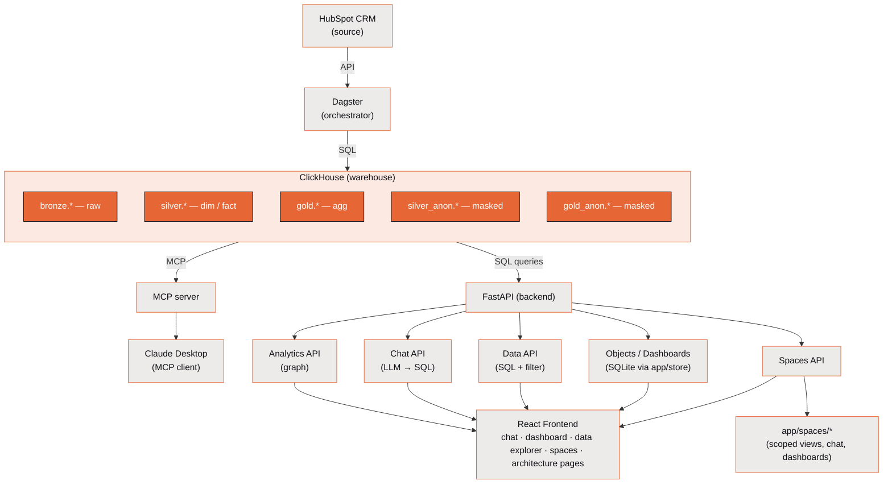
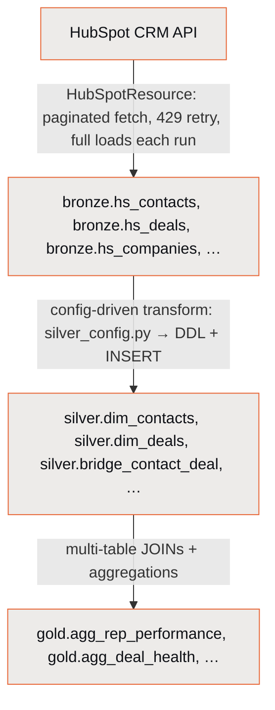
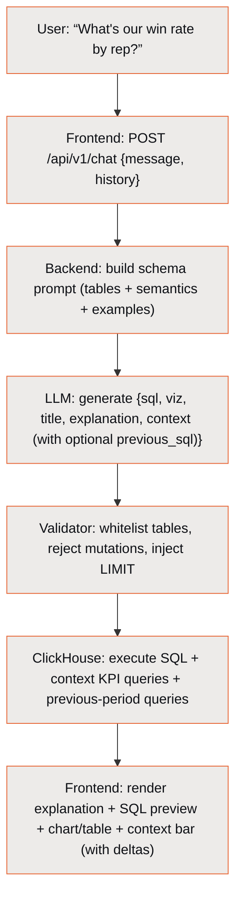
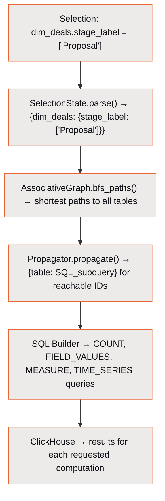
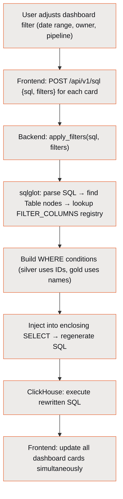
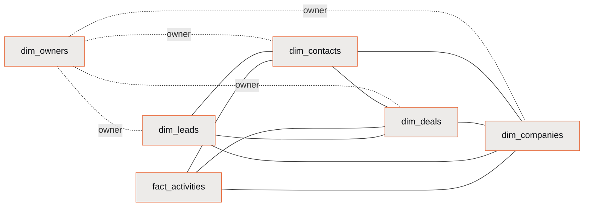

# Architecture

> The overall system architecture: how the components connect, how data flows between them, and the design decisions behind them.

---

## Contents

- [System Overview](#system-overview)
- [Data Flow](#data-flow)
- [Design Decisions](#design-decisions)
- [Relationship Graph](#relationship-graph)
- [File Structure](#file-structure)
- [Deployment Topology](#deployment-topology)
- [Security Considerations](#security-considerations)

---

## System Overview



The MCP server (`app/mcp/`) is a separate process — not part of the FastAPI app — but it reuses the same schema-prompt builder, SQL validator, and table catalog so external Claude clients see the same grounded context as in-app chat.

---

## Data Flow

### 1. Ingestion (Hourly)



Each layer is a separate ClickHouse database (`bronze`, `silver`, `gold`). Tables use `ReplacingMergeTree` for deduplication.

### 2. Chat Query (Interactive)



**Latency budget:**

| Step | Typical Time |
|------|-------------|
| LLM call (cached prompt) | 800-1500ms |
| SQL validation | <1ms |
| ClickHouse execution | 10-100ms |
| Frontend render | <50ms |
| **Total** | **~1-2 seconds** |

### 3. Linked-Selection Query (Programmatic)



### 4. Dashboard Query (Interactive)



**No AI involved** — purely AST-based SQL rewriting via sqlglot. Tables not in the registry are silently skipped. If parsing fails, the original SQL is returned unchanged.

---

## Design Decisions

### Why ClickHouse?

ClickHouse is a columnar OLAP database optimized for analytical queries. For this use case:

- **Fast aggregations** — Sum, count, avg over millions of rows in milliseconds
- **ReplacingMergeTree** — Built-in deduplication for incremental ingestion
- **FINAL modifier** — Query-time deduplication without explicit merge operations
- **Dictionaries** — In-memory lookup tables for fast dimension joins
- **Low overhead** — Single Docker container, no cluster needed for this scale

### Why a Three-Layer Architecture?

| Decision | Rationale |
|----------|-----------|
| Bronze stores raw JSON | If HubSpot changes a property name or adds a field, nothing breaks. We re-extract from bronze. |
| Silver is config-driven | Adding a property is a one-line change. No migration files, no schema diffs. |
| Silver rebuilds fully | ClickHouse makes this fast. Avoids migration complexity and schema drift. |
| Gold pre-aggregates | Complex multi-table JOINs are expensive. Gold computes them once per hour. |
| Separate databases | Clear namespace separation. Different retention policies per layer. |

### Why LLM for SQL Instead of a Query Builder?

Revenue leaders don't think in filters and aggregations — they think in questions: "Will we hit target?", "Which deals are slipping?", "What's different about Alex's win rate?"

A traditional dashboard with fixed views can't anticipate these questions. An LLM that sees the schema and business context can generate the exact SQL needed for any ad-hoc question, while the structured output format ensures deterministic rendering.

**Safety model:**
- The LLM never sees actual data — only schema metadata and column descriptions
- SQL is validated before execution (whitelist tables, reject mutations)
- Auto-injected LIMIT prevents accidental full-table scans
- Prompt caching keeps latency under 2 seconds

### Why Linked Selections?

Linked selections provide a fundamentally different UX than traditional filtering:

- **One selection, all tables filter** — Select "Proposal" stage and instantly see which contacts, companies, and activities are connected to those deals
- **Three-state field values** — Values are "possible" (reachable given current selections), "excluded" (not reachable), or "selected" (active filter)
- **No explicit JOINs** — The graph engine handles bridge traversal automatically

This is more intuitive for non-technical users exploring data relationships.

### Why Multi-Provider LLM?

Different users have different access:

| Provider | Use Case |
|----------|----------|
| Anthropic API | Team has API key, best quality + prompt caching |
| OpenAI API | Already has OpenAI key, good fallback |
| Claude OAuth | Individual Claude Pro/Max subscriber, no API key needed |
| Claude CLI | Developer with Claude Code installed, zero config |

Auto-detection means the system works out of the box for developers (CLI) and is easily configured for production (API key).

---

## Relationship Graph

The core data model is a graph of queryable tables connected by 9 bridge tables. ID-to-label resolution uses 9 ClickHouse dictionaries (via `dictGet()`) instead of JOINs.

### Entities



Solid edges are the 9 N:M bridge tables (below); dotted edges are `owner_id` reference lookups resolved via dictionaries.

### Bridge Tables (N:M Relationships)

| Bridge | Connects | Via |
|--------|----------|-----|
| `bridge_contact_company` | Contacts <-> Companies | `contact_id`, `company_id` |
| `bridge_contact_deal` | Contacts <-> Deals | `contact_id`, `deal_id` |
| `bridge_deal_company` | Deals <-> Companies | `deal_id`, `company_id` |
| `bridge_lead_contact` | Leads <-> Contacts | `lead_id`, `contact_id` |
| `bridge_deal_lead` | Deals <-> Leads | `deal_id`, `lead_id` |
| `bridge_lead_company` | Leads <-> Companies | `lead_id`, `company_id` |
| `bridge_activity_contact` | Activities <-> Contacts | `activity_id`, `contact_id` |
| `bridge_activity_company` | Activities <-> Companies | `activity_id`, `company_id` |
| `bridge_activity_deal` | Activities <-> Deals | `activity_id`, `deal_id` |

### Dictionaries (ID-to-Label Resolution)

Instead of JOINs, the LLM generates `dictGet()` calls for ID-to-name resolution. 9 dictionaries backed by silver dimension tables:

| Dictionary | Key(s) | Resolves |
|-----------|--------|----------|
| `dict_owners` | `owner_id` | Owner full name, email |
| `dict_pipelines` | `pipeline_id` | Deal pipeline label |
| `dict_pipeline_stages` | `stage_id` | Deal stage label, is_closed, display_order |
| `dict_lead_pipelines` | `pipeline_id` | Lead pipeline label |
| `dict_lead_pipeline_stages` | `(pipeline_id, stage_id)` | Lead stage label (composite key) |
| `dict_contacts` | `contact_id` | Contact full name, email |
| `dict_companies` | `company_id` | Company name, domain, industry |
| `dict_deals` | `deal_id` | Deal name, amount, owner_name |
| `dict_lists` | `list_id` | List/segment name, type, member object type |

---

## File Structure

<details>
<summary><strong>Full backend + frontend tree</strong></summary>

<br/>

```text
ClickSpot/
|-- app/                          # FastAPI backend
|   |-- main.py                   # App entry, CORS, router mounting, SQLite init, space load
|   |-- db.py                     # ClickHouse client singleton (session-id-disabled)
|   |-- config.py                 # Table/graph/join configuration (derived from silver_config.py)
|   |-- store.py                  # SQLite persistence for objects/dashboards/conversations/spaces
|   |-- api/
|   |   |-- routes.py             # Analytics engine endpoints
|   |   |-- chat_routes.py        # Chat + settings + OAuth + schema/refresh endpoints
|   |   |-- data_routes.py        # SQL execution + filter injection + filter options + test-filter
|   |   |-- object_routes.py      # Saved query+viz objects CRUD (/api/v1/objects)
|   |   |-- dashboard_routes.py   # Dashboards + items + layouts (/api/v1/dashboards)
|   |   |-- conversation_routes.py# Chat history persistence (/api/v1/conversations)
|   |   |-- models.py             # Analytics request/response models
|   |   |-- chat_models.py        # Chat request/response models
|   |-- engine/
|   |   |-- graph.py              # AssociativeGraph (BFS, adjacency)
|   |   |-- propagator.py         # Selection propagation
|   |   |-- state.py              # SelectionState dataclass
|   |   |-- sql_builder.py        # SQL generation functions
|   |   |-- sql_filter.py         # Dashboard filter SQL rewriting (sqlglot)
|   |   |-- metrics.py            # 22 computed metrics registry
|   |   |-- anon_masking.py       # PII masking for silver_anon / gold_anon
|   |-- llm/
|   |   |-- config.py             # Multi-provider config (~/.clickspot/config.json)
|   |   |-- providers.py          # Anthropic, OpenAI, OAuth, CLI providers
|   |   |-- schema_prompt.py      # LLM system prompt builder
|   |   |-- response_schema.py    # Structured output models
|   |   |-- sql_validator.py      # SQL safety (whitelist + mutation blocking + LIMIT)
|   |   |-- oauth.py              # Claude OAuth token management
|   |-- semantic/
|   |   |-- layer.py              # HubSpot property metadata enrichment
|   |-- spaces/                   # Data Spaces feature
|   |   |-- config.py             # DataSpaceConfig schema
|   |   |-- discovery.py          # Grain entity + dimension introspection
|   |   |-- registry.py           # CRUD + preview + startup load_saved_spaces()
|   |   |-- space_filter.py       # Per-space SQL rewriting
|   |   |-- space_prompt.py       # Schema prompt scoped to a single space
|   |   |-- generator.py          # Helpers for derived assets
|   |   |-- routes.py             # 26 endpoints under /api/v1/spaces/*
|   |-- mcp/                      # MCP server (separate process)
|       |-- server.py             # FastMCP entrypoint (python -m app.mcp.server)
|       |-- guardrails.py         # MCP_ALLOWED_TABLES + EXCLUDED_TABLES + activity strip
|       |-- pii.py                # PII filters for MCP responses
|
|-- assets/                       # Dagster assets (ETL)
|   |-- crm.py                    # CRM object extraction (4 factory + hs_owners = 5 assets)
|   |-- activities.py             # Activity extraction (5 assets)
|   |-- marketing.py              # Marketing + lists (4 factory + hs_lists + hs_form_submissions + 4 list-membership = 10 assets)
|   |-- associations.py           # Association bridges (21 assets)
|   |-- silver.py                 # Silver transform (10 dim + 3 fact + 13 bridge + DQ)
|   |-- gold.py                   # Gold aggregates (7 assets)
|   |-- silver_anon.py            # PII-masked silver mirrors in silver_anon db
|   |-- gold_anon.py              # PII-masked gold mirrors in gold_anon db
|
|-- resources/                    # Dagster resources
|   |-- hubspot.py                # HubSpot API client
|   |-- clickhouse.py             # ClickHouse bulk insert client
|
|-- frontend/                     # React application
|   |-- src/
|   |   |-- main.tsx              # Entry + router setup (9 routes)
|   |   |-- App.tsx               # Main chat layout + nav (Library / Dashboard / Spaces / Data / Arch)
|   |   |-- components/
|   |   |   |-- chat/             # Chat UI (container, message, input, SQL, suggestions)
|   |   |   |-- dashboard/        # Dashboard UI (card, filter bar, add drawer)
|   |   |   |-- viz/              # Visualizations (number, table, bar, line, funnel, comparison)
|   |   |   |-- charts/           # Lower-level chart primitives
|   |   |   |-- spaces/           # Spaces UI (designer, picker, preview, chat drawer)
|   |   |   |-- settings/         # Settings drawer
|   |   |   |-- diagrams/         # Architecture SVG diagrams
|   |   |-- hooks/                # useChat, useConversations, useDashboards, useObjectRepo,
|   |   |                         # useFilterOptions, usePageTitle, useAnalyticsQuery,
|   |   |                         # useDataSpaces, useSelectionState, useSpaceChat, useSpaceDashboards
|   |   |-- types/                # TypeScript interfaces (chat, dashboard, api)
|   |   |-- pages/                # DashboardPage, ObjectLibraryPage, DataExplorerPage, ArchitecturePage,
|   |                             # DataSpaceListPage, DataSpaceDesignerPage,
|   |                             # SpaceOverviewPage, SpaceDashboardPage
|   |-- vite.config.ts            # Dev server + proxy config
|   |-- package.json
|
|-- scripts/
|   |-- init_clickhouse.py        # Schema initialization
|   |-- init_clickhouse.sql       # DDL for bronze/silver/gold databases
|
|-- definitions.py                # Dagster: assets + jobs + schedule + sensors + resources
|-- jobs.py                       # Dagster: bronze_job, silver_job, gold_job, anon_job
|-- schedules.py                  # Dagster: hourly cron on bronze_job (default STOPPED)
|-- sensors.py                    # bronze → silver → gold → anon trigger chain
|-- silver_config.py              # Silver layer column definitions + dictionaries (SSoT — order_by, partition_by, indexes)
|-- docker-compose.yml            # ClickHouse service (image pinned to 26.2.5.45)
|-- clickhouse/
|   |-- config.xml                # Server config: merge_tree.index_granularity=4096
|   |-- users.xml                 # User profile: memory caps, spill thresholds, max_partitions_per_insert_block=500
|-- start.sh                      # Multi-service startup script
|-- pyproject.toml                # Python project metadata + dependencies
|-- .env                          # Environment variables (gitignored)
|-- .env.example                  # Template for .env
```

</details>

---

## Deployment Topology

### Local Development

All services run locally via `start.sh`:

| Service | Port | Process |
|---------|------|---------|
| ClickHouse | 8124 (HTTP), 9001 (native) | Local `.clickhouse/` runtime by default; Docker optional |
| FastAPI | 8192 | Uvicorn (Python) |
| Dagster | 8194 | Dagster webserver + daemon |
| Frontend | 8193 | Vite dev server (Node.js) |

### Production (Single Server)

```bash
# ClickHouse: local managed runtime, Docker, or native install
# Backend: gunicorn + uvicorn workers
# Frontend: vite build -> serve static from FastAPI
# Dagster: dagster-daemon + dagster-webserver (systemd)
```

Environment variables via `.env` or secrets manager. `DAGSTER_HOME` for persistent storage.

---

## Security Considerations

See `SECURITY_AUDIT.md` for the full audit. Key points:

- **SQL injection** — Analytics engine validates column names against config whitelist. Chat SQL validator blocks mutations and restricts table access.
- **No authentication** — Currently no auth on any endpoint. Suitable for local/VPN-only deployment.
- **CORS** — Wildcard (`*`) in development. Should be restricted to `http://localhost:8193` in production.
- **API keys** — Stored in `~/.clickspot/config.json` with `0600` permissions. Returned masked via API.
- **LLM data isolation** — The LLM never sees query results or business data. Only schema metadata and user questions.
- **ClickHouse credentials** — Default `hs2ch`/`hs2ch` in development. Should use a read-only user in production.

---

<sub>[← README](../README.md) · **Architecture** · [Data Pipeline](data-pipeline.md) · [Backend](backend.md) · [Frontend](frontend.md) · [ClickHouse Evaluation](clickhouse-evaluation.md)</sub>
