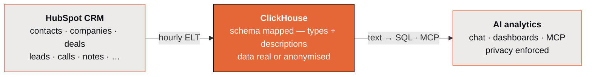
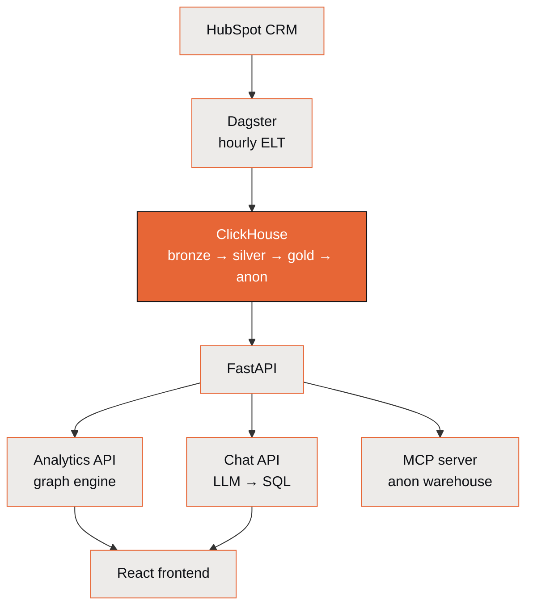

# How ClickSpot works

ClickSpot has three stages: pull HubSpot CRM into ClickHouse, transform it through a
medallion warehouse, then serve it through an AI analytics layer that answers questions in
SQL — without ever showing raw data to the model.



## The full path

1. **Extract** contacts, companies, deals, leads, activities, pipelines, and associations
   from HubSpot's CRM API.
2. **Load** raw data into ClickHouse bronze tables (full list-endpoint loads, deduplicated).
3. **Transform** into typed silver dimensions, facts, and bridge tables (config-driven).
4. **Aggregate** into gold tables for rep performance, deal health, source attribution, and
   pipeline snapshots.
5. **Anonymize** silver/gold into `silver_anon` / `gold_anon` databases for safe external
   sharing (MCP, demos).
6. **Serve** five interfaces over the warehouse.

## How the pieces are wired



## The five interfaces

| Interface | What it does |
|---|---|
| [**Chat**](../guides/chat.md) | Ask questions in natural language, get SQL + visualizations |
| [**Dashboards**](../guides/dashboards.md) | Pin chat results to persistent dashboards with global filters (date, owner, pipeline) |
| [**Data Spaces**](data-spaces.md) | Scoped, configured views over the warehouse, each with its own chat, dashboards, and filters |
| [**Analytics API**](../guides/analytics-api.md) | Relationship-graph query engine with cross-table selection propagation |
| [**MCP server**](../guides/mcp.md) | Exposes the anonymized warehouse to Claude Desktop / other MCP clients with the same schema prompt and SQL guardrails as in-app chat |

## How chat turns a question into an answer

```
User question
    -> Schema prompt (tables + semantics + business context)
    -> LLM (Claude / GPT-4o)
    -> Structured response {sql, viz, title, explanation, context}
    -> SQL validation (whitelist tables, block mutations)
    -> ClickHouse execution
    -> Chart / table / number rendered inline
```

The LLM never sees actual data — only schema metadata and property descriptions from
HubSpot. Queries use relative date expressions (`today()`, `toStartOfMonth()`) so saved
results stay current, and period-over-period comparisons show colored delta badges.

That schema-only contract is the heart of the design — read
[The privacy model](privacy.md) for exactly what does and doesn't reach the LLM.

## Going deeper

The published docs above cover the product. For implementation detail, the engineering
docs go further:

- [Architecture overview](../architecture.md) — system design and the relationship graph
- [Data pipeline](../data-pipeline.md) — bronze/silver/gold/anon layers and the sensor chain
- [Backend](../backend.md) — analytics engine, chat API, SQL validation, spaces, MCP
- [Frontend](../frontend.md) — chat UI, visualization components, hooks
