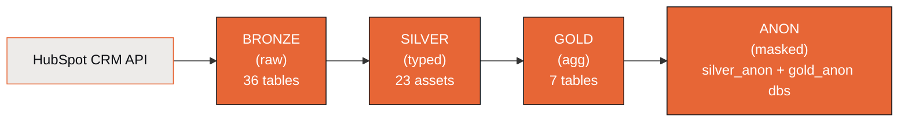

# Data Pipeline

> ClickSpot runs an hourly ELT pipeline orchestrated by **Dagster**, extracting data from HubSpot's CRM APIs and loading it through a three-layer medallion architecture in ClickHouse.

---

## Contents

- [Medallion Architecture](#medallion-architecture)
- [Bronze Layer](#bronze-layer)
- [Silver Layer](#silver-layer)
- [Gold Layer](#gold-layer)
- [Anon Layer](#anon-layer)
- [Orchestration](#orchestration)
- [Adding New Data](#adding-new-data)

---

## Medallion Architecture



| Layer | Purpose | Engine | Refresh Strategy |
|-------|---------|--------|------------------|
| **Bronze** | Raw extraction from HubSpot. Safety net — nothing is lost. | `ReplacingMergeTree(_extracted_at)` | Full list-endpoint loads each run, deduped by `_record_id` |
| **Silver** | Clean, typed dimensions, facts, and bridges. No business logic. | `ReplacingMergeTree(_silver_loaded_at)` | Atomic swap via `EXCHANGE TABLES` (build into staging, swap in place) |
| **Gold** | Pre-computed aggregates for analytics. | `ReplacingMergeTree(_gold_loaded_at)` | Full rebuild |
| **Anon** | PII-masked mirror of silver + gold for safe external sharing (MCP, demos). | `ReplacingMergeTree` | Rebuilt after gold via the `trigger_anon_after_gold` sensor |

---

## Bronze Layer

Bronze assets extract raw HubSpot data and store it as-is. Every record preserves the full JSON response in `_raw` and a flattened `properties Map(String, String)` for quick access.

### Schema

Every bronze table shares the same shape:

```sql
CREATE TABLE bronze.<table_name> (
    _record_id    String,          -- HubSpot object ID
    _extracted_at DateTime,        -- When we pulled this record
    properties    Map(String, String),  -- Flattened property map
    _raw          String           -- Full JSON response
) ENGINE = ReplacingMergeTree(_extracted_at)
  ORDER BY (_record_id)
```

`ReplacingMergeTree` deduplicates by `_record_id`, keeping the row with the latest `_extracted_at`.

### Assets

#### CRM Objects (5 assets)

The CRM list endpoint is versioned with a date header in the URL — `API_VERSION = "2026-03"` in `resources/hubspot.py`. Owners use the older `v3` path.

| Asset | HubSpot API | Notes |
|-------|-------------|-------|
| `hs_contacts` | `/crm/objects/{API_VERSION}/contacts` | Full list load with dynamic property discovery |
| `hs_companies` | `/crm/objects/{API_VERSION}/companies` | Full list load with dynamic property discovery |
| `hs_deals` | `/crm/objects/{API_VERSION}/deals` | Full list load with dynamic property discovery |
| `hs_leads` | `/crm/objects/{API_VERSION}/leads` | Full list load with dynamic property discovery |
| `hs_owners` | `/crm/v3/owners` | Full load, flat JSON (no `properties` map) |

Built with `_make_crm_asset()` factory in `assets/crm.py` (`hs_owners` is a bespoke `@asset` in the same file).

#### Activities (5 assets)

| Asset | HubSpot API | Type Discriminator |
|-------|-------------|-------------------|
| `hs_calls` | `/crm/objects/{API_VERSION}/calls` | `call` |
| `hs_meetings` | `/crm/objects/{API_VERSION}/meetings` | `meeting` |
| `hs_engagement_emails` | `/crm/objects/{API_VERSION}/emails` | `email` |
| `hs_notes` | `/crm/objects/{API_VERSION}/notes` | `note` |
| `hs_tasks` | `/crm/objects/{API_VERSION}/tasks` | `task` |

Built with the same `_make_crm_asset()` factory in `assets/activities.py`.

#### Marketing & Pipelines (5 assets)

| Asset | HubSpot API | Notes |
|-------|-------------|-------|
| `hs_pipelines` | `/crm/v3/pipelines/deals` | Contains nested `stages` array |
| `hs_lead_pipelines` | `/crm/v3/pipelines/leads` | Contains nested `stages` array |
| `hs_campaigns` | `/marketing/v3/campaigns` | Full load |
| `hs_forms` | `/marketing/v3/forms` | Full load |
| `hs_form_submissions` | `/form-integrations/v1/submissions/forms/{formId}` | Legacy v1 endpoint. Bespoke `@asset` (not factory-based) — first lists forms via `fetch_all_form_ids()`, then iterates submissions per form. |

The first four are built with `_make_marketing_asset()` factory in `assets/marketing.py`; `hs_form_submissions` is a bespoke `@asset` in the same file.

#### Associations (21 bridge assets)

HubSpot associations are **N:M:N** — a contact can be associated with many deals, and a deal with many contacts, each with a typed association label.

**CRM-to-CRM (6):**
- `hs_assoc_contact_company`, `hs_assoc_contact_deal`, `hs_assoc_deal_company`
- `hs_assoc_lead_contact`, `hs_assoc_deal_lead`, `hs_assoc_lead_company`

**Activity-to-CRM (15):**
- 5 activity types x 3 CRM objects (contacts, companies, deals):
  `hs_assoc_call_contact`, `hs_assoc_call_company`, `hs_assoc_call_deal`, etc.

Each association record contains `(_from_id, _to_id, _association_type)`.

Built with `_make_association_asset()` factory in `assets/associations.py`.

### Property Discovery & Pagination

Bronze CRM assets use a two-step pattern, not a search-based HWM:

1. **Property discovery** — for each object type, call `/crm/objects/{API_VERSION}/{type}/properties` to enumerate all available property names.
2. **List with explicit properties** — call the list endpoint with `?properties=<comma-joined names>&limit=100`, walking pages via `paging.next.after` cursor.
3. **Deduplication** — `ReplacingMergeTree(_extracted_at) ORDER BY (_record_id)` keeps only the latest version per ID across re-runs.

This is a full load each run (not incremental). A `/search`-based high-water-mark path is not currently wired up — adding it would be the standard way to cut payload at scale.

### Rate Limiting & Retries

HubSpot enforces 150 requests per 10 seconds. `HubSpotResource` handles this with:
- Exponential backoff on 429 / 502 / 503 (up to 5 retries, capped at 60s)
- Batch pagination (100 records per page)
- Associations use a POST batch-read endpoint (1000 IDs per batch)

---

## Silver Layer

Silver transforms bronze data into typed, query-ready dimensional tables. Configuration-driven — adding a property is a one-line change in `silver_config.py`.

### Configuration

`silver_config.py` is the single source of truth. Each dimension is a dict with a column list of `(silver_column_name, bronze_property_key, clickhouse_type)` tuples.

```python
# Example: adding a new property
DIM_DEALS = {
    "bronze_table": "hs_deals",
    "primary_key": "deal_id",
    "columns": [
        ("dealname",    "dealname",    "String"),
        ("amount",      "amount",      "Nullable(Float64)"),
        ("closedate",   "closedate",   "DateTime"),
        # Add new property here:
        ("new_field",   "hs_new_field", "String"),
    ],
}
```

### Dimension Tables (10)

| Table | Source | Primary Key | Column Count | Key Columns |
|-------|--------|-------------|-------------|-------------|
| `dim_contacts` | `hs_contacts` | `contact_id` | 43 | `full_name`, `email`, `lifecyclestage`, sales activity/email/sequence dates |
| `dim_companies` | `hs_companies` | `company_id` | 41 | `name`, `domain`, `industry`, sales activity dates, meeting/call/email dates |
| `dim_deals` | `hs_deals` | `deal_id` | 70 | `dealname`, `amount`, `dealstage`, `pipeline`, financial metrics, stage dates |
| `dim_leads` | `hs_leads` | `lead_id` | 35 | `hs_lead_name`, `hs_pipeline`, `hs_pipeline_stage`, engagement dates (lead/contact/company level) |
| `dim_owners` | `hs_owners` | `owner_id` | 8 | `first_name`, `last_name`, `email` |
| `dim_pipelines` | `hs_pipelines` | `pipeline_id` | 4 | `label` |
| `dim_pipeline_stages` | `hs_pipelines` (ARRAY JOIN) | `stage_id` | — | `label`, `pipeline_id`, `is_closed`, `display_order` |
| `dim_lead_pipelines` | `hs_lead_pipelines` | `pipeline_id` | — | `label` |
| `dim_lead_pipeline_stages` | `hs_lead_pipelines` (ARRAY JOIN) | — | — | `label`, `pipeline_id`, `is_closed` |

**~197 total columns** across the 5 main dimension tables, including comprehensive date/timestamp and activity type fields from HubSpot at lead, contact, and company levels.

**Special cases:**
- **`dim_deals`** denormalizes `pipeline_label`, `stage_label`, and `owner_name` via LEFT JOINs at load time.
- **`dim_pipeline_stages`** and **`dim_lead_pipeline_stages`** use `ARRAY JOIN` to flatten nested stage arrays from pipeline records.

### Fact Tables (3)

| Table | Source | Primary Key | Description |
|-------|--------|-------------|-------------|
| `fact_activities` | 5 bronze activity tables | `activity_id` | UNION ALL with `activity_type` discriminator ('call', 'meeting', 'email', 'note', 'task') |
| `fact_stage_history` | bronze leads/deals/contacts | composite | Stage enter/exit tracking. Dynamically discovers stage IDs from bronze property keys (`hs_v2_date_entered_*`, `hs_date_entered_*`). Columns: `entity_type`, `stage_id`, `stage_label`, `entered_at`, `exited_at`, `duration_ms` |
| `fact_form_submissions` | `hs_form_submissions` | `submission_id` | One row per form submission with `form_id`, `submitted_at`, `page_url`, and the submitted values flattened from the v1 endpoint's `values[]` array |

### Bridge Tables (9)

| Table | From Key | To Key | Source |
|-------|----------|--------|--------|
| `bridge_contact_company` | `contact_id` | `company_id` | `hs_assoc_contact_company` |
| `bridge_contact_deal` | `contact_id` | `deal_id` | `hs_assoc_contact_deal` |
| `bridge_deal_company` | `deal_id` | `company_id` | `hs_assoc_deal_company` |
| `bridge_lead_contact` | `lead_id` | `contact_id` | `hs_assoc_lead_contact` |
| `bridge_deal_lead` | `deal_id` | `lead_id` | `hs_assoc_deal_lead` |
| `bridge_lead_company` | `lead_id` | `company_id` | `hs_assoc_lead_company` |
| `bridge_activity_contact` | `activity_id` | `contact_id` | 5 activity-contact assoc tables |
| `bridge_activity_company` | `activity_id` | `company_id` | 5 activity-company assoc tables |
| `bridge_activity_deal` | `activity_id` | `deal_id` | 5 activity-deal assoc tables |

### ClickHouse Dictionaries (8)

Silver tables that serve as lookup references have in-memory dictionaries for fast `dictGet()` lookups, replacing JOINs:

| Dictionary | Source Table | Key(s) | Layout | Values |
|-----------|-------------|--------|--------|--------|
| `dict_owners` | `dim_owners` | `owner_id` | HASHED | `first_name`, `last_name`, `email` |
| `dict_pipelines` | `dim_pipelines` | `pipeline_id` | HASHED | `label` |
| `dict_pipeline_stages` | `dim_pipeline_stages` | `stage_id` | HASHED | `label`, `pipeline_id`, `is_closed`, `display_order` |
| `dict_lead_pipelines` | `dim_lead_pipelines` | `pipeline_id` | HASHED | `label` |
| `dict_lead_pipeline_stages` | `dim_lead_pipeline_stages` | `(pipeline_id, stage_id)` | COMPLEX_KEY_HASHED | `label`, `display_order`, `is_closed` |
| `dict_contacts` | `dim_contacts` | `contact_id` | HASHED | `full_name`, `email` |
| `dict_companies` | `dim_companies` | `company_id` | HASHED | `name`, `domain`, `industry` |
| `dict_deals` | `dim_deals` | `deal_id` | HASHED | `dealname`, `amount`, `owner_name` |

Dictionary config is defined in `DICT_CONFIGS` in `silver_config.py`, which serves dual purpose: DDL generation (`_build_dict_ddl()`) and LLM prompt generation (auto-generates `dictGet()` examples per table). During silver refresh, dependent dictionaries are dropped before the table and recreated after via `EXCHANGE TABLES`.

### Data Quality

The `dq_metrics` asset runs after all silver tables and records:
- **Row counts** per table
- **Null rates** for critical fields (`email`, `name`, `dealname`)
- **Archived rates** per dimension
- **Orphan counts** for bridge table foreign keys

Metrics are stored in `silver.dq_metrics` (append-only, 90-day TTL).

### Refresh Strategy

Silver uses a full-rebuild approach with atomic swap — no downtime window:

1. `DROP DICTIONARY` (if dependent)
2. `DROP TABLE IF EXISTS silver.<table>_tmp`
3. `CREATE TABLE silver.<table>_tmp` (with `ORDER BY`, `PARTITION BY`, `INDEX`)
4. `INSERT INTO silver.<table>_tmp SELECT FROM bronze.<table> FINAL`
5. `EXCHANGE TABLES silver.<table> AND silver.<table>_tmp`
6. `DROP TABLE silver.<table>_tmp`
7. `CREATE DICTIONARY` (if applicable)

This avoids migration complexity. ClickHouse's columnar storage makes full rebuilds fast (typically under 10 seconds for datasets up to 100K records per table).

### Partitioning & Skip Indexes

Silver dims/facts and three gold tables are partitioned by the natural date axis of each entity (see `silver_config.py` `partition_by` field and the bespoke fact/gold DDLs):

| Table | Partition |
|-------|-----------|
| `silver.dim_contacts` / `dim_companies` / `dim_leads` | `toYYYYMM(toDate(createdate))` |
| `silver.dim_deals` | `toYYYYMM(toDate(createdate))` — note `createdate`, not `closedate`, because `closedate` has 1970/2106 sentinel values |
| `silver.fact_form_submissions` | `toYYYYMM(toDate(submitted_at))` |
| `silver.fact_activities` / `fact_stage_history` | `toYear(toDate(...))` — multi-year spans would otherwise blow past `max_partitions_per_insert_block` |
| `gold.agg_rep_performance` / `agg_deal_cohorts` / `fact_pipeline_snapshots` | `toYYYYMM(...)` of `period_start` / `cohort_month` / `snapshot_date` |

Bloom-filter skip indexes (`bloom_filter(0.01) GRANULARITY 4`):

| Table | Column |
|-------|--------|
| `silver.dim_deals` | `hubspot_owner_id` |
| `silver.dim_contacts` | `email` |
| `silver.dim_leads` | `hubspot_owner_id` |

Small lookup dims (`dim_owners`, `dim_pipelines`, `*_stages`) and bridge tables are intentionally unpartitioned and un-indexed.

---

## Gold Layer

Gold tables contain pre-computed aggregates optimized for analytics dashboards. They join multiple silver tables and compute business metrics.

### Aggregate Tables (7)

#### `agg_rep_performance`

Monthly sales rep performance metrics.

| Column | Type | Description |
|--------|------|-------------|
| `hubspot_owner_id` | String | Rep identifier |
| `owner_name` | String | Denormalized rep name |
| `period_start` | Date | First day of month |
| `deals_won` / `deals_lost` / `deals_created` | UInt32 | Deal counts |
| `win_rate` | Float64 | Won / (Won + Lost) |
| `total_arr_closed` | Float64 | Sum of ARR on closed-won deals |
| `avg_deal_size` | Float64 | Average deal amount |
| `avg_days_to_close` | Float64 | Average close cycle |
| `pipeline_value` | Float64 | Sum of open deal amounts |
| `calls_count` / `meetings_count` / `emails_count` / `tasks_count` | UInt32 | Activity counts via bridges |
| `total_activities` | UInt32 | Sum of all activities |

#### `agg_deal_health`

Per-deal health indicators for pipeline management.

| Column | Type | Description |
|--------|------|-------------|
| `deal_id` | String | Deal identifier |
| `days_in_current_stage` | Int32 | Days since last stage change |
| `days_since_last_activity` | Int32 | Days since any associated activity |
| `last_activity_date` / `last_activity_type` | DateTime / String | Most recent activity |
| `has_future_activity` | UInt8 | Boolean: scheduled future activity exists |
| `is_stale` | UInt8 | >14 days with no activity |
| `missing_amount` / `missing_closedate` / `missing_owner` | UInt8 | Data quality flags |

#### `agg_source_attribution`

Lead source attribution funnel.

| Column | Type | Description |
|--------|------|-------------|
| `hs_analytics_source` | String | Top-level source (ORGANIC, PAID, REFERRAL, etc.) |
| `hs_analytics_source_data_1` | String | Source detail |
| `contacts_count` / `mql_count` / `sql_count` | UInt32 | Funnel stage counts |
| `deals_associated` / `deals_won` | UInt32 | Deal conversion counts |
| `closed_won_value` | Float64 | Total closed-won deal value |

#### `agg_lead_health`

Per-lead health indicators with denormalized pipeline/stage labels via dictionaries.

| Column | Type | Description |
|--------|------|-------------|
| `lead_id` | String | Lead identifier |
| `lead_name` / `owner_name` | String | Denormalized via `dictGet()` |
| `pipeline_label` / `stage_label` | String | Via `dict_lead_pipelines` / `dict_lead_pipeline_stages` |
| `days_in_current_stage` | Nullable(UInt32) | Days since entering current stage |
| `days_since_last_engagement` | Nullable(UInt32) | Days since last engagement |
| `has_outreach` / `has_associated_deal` | UInt8 | Boolean flags |
| `is_stale` | UInt8 | Not closed AND no engagement in 7+ days |

#### `agg_deal_cohorts`

Monthly deal cohort analysis grouped by close month and pipeline.

#### `agg_deal_stage_funnel`

Deal counts per stage for funnel visualization.

#### `fact_pipeline_snapshots`

Daily pipeline state snapshots for trend analysis.

| Column | Type | Description |
|--------|------|-------------|
| `snapshot_date` | Date | Snapshot date |
| `pipeline` | String | Pipeline ID |
| `total_open_deals` / `total_pipeline_value` | UInt32 / Float64 | Open pipeline state |
| `weighted_pipeline_value` | Float64 | Probability-weighted value |
| `closed_won_value` | Float64 | Already-closed value |

---

## Anon Layer

Mirrors silver + gold into the `silver_anon` and `gold_anon` databases with PII masked. Used to expose the warehouse to external Claude clients via MCP, and for demos.

- **Assets:** `assets/silver_anon.py` and `assets/gold_anon.py` rebuild the anon mirrors from the corresponding silver/gold tables.
- **Masking:** `app/engine/anon_masking.py` rewrites emails, names, and domains while preserving IDs so joins still work. IDs and dictionaries pass through; free-text fields are scrubbed.
- **Schedule:** the `trigger_anon_after_gold` sensor in `sensors.py` runs `anon_job` whenever `gold_job` succeeds.

---

## Orchestration

### Dagster Jobs

| Job | Assets | Purpose |
|-----|--------|---------|
| `bronze_job` | All bronze + association assets | Extract from HubSpot |
| `silver_job` | All silver dim/fact/bridge + DQ | Transform to typed tables (max 3 concurrent) |
| `gold_job` | All gold aggregates | Compute analytics |
| `anon_job` | All silver_anon + gold_anon assets | Rebuild PII-masked mirrors |

### Schedule + Sensors

Only `bronze_job` is on a cron schedule. Silver, gold, and anon are chained by run-status sensors so each runs as soon as its predecessor succeeds.

```python
# schedules.py
hourly_schedule = ScheduleDefinition(
    job=bronze_job,
    cron_schedule="0 * * * *",
    default_status=DefaultScheduleStatus.STOPPED,  # off by default — enable in the Dagster UI
)

# sensors.py
trigger_silver_after_bronze  # bronze_job SUCCESS → request silver_job
trigger_gold_after_silver    # silver_job SUCCESS → request gold_job
trigger_anon_after_gold      # gold_job SUCCESS   → request anon_job
```

### Resources

| Resource | Class | Target |
|----------|-------|--------|
| `hubspot` | `HubSpotResource` | HubSpot CRM API |
| `ch` | `ClickHouseResource` | `bronze` database |
| `ch_silver` | `ClickHouseResource` | `silver` database |
| `ch_gold` | `ClickHouseResource` | `gold` database |
| `ch_silver_anon` | `ClickHouseResource` | `silver_anon` database |
| `ch_gold_anon` | `ClickHouseResource` | `gold_anon` database |

### Dagster Home

Set `DAGSTER_HOME` in `.env` to persist run history, schedules, and asset materialization state across restarts. Without it, Dagster uses a temporary directory that is lost on exit.

---

## Adding New Data

### New HubSpot CRM Object

```python
# assets/crm.py — one line
hs_tickets = _make_crm_asset("tickets", "hs_tickets")
```

### New Silver Property

```python
# silver_config.py — one tuple
DIM_DEALS["columns"].append(
    ("new_field", "hs_new_field_name", "String"),
)
```

### New Silver Dimension

1. Add config block to `silver_config.py`
2. Call `_make_dim_asset("new_table", NEW_CONFIG)` in `assets/silver.py`
3. Add to `all_silver_assets` list

### New Association Bridge

```python
# assets/associations.py — one line
hs_assoc_ticket_contact = _make_association_asset("ticket", "contact")
```

Then add the silver bridge in `silver_config.py` BRIDGE_TABLES and `assets/silver.py`.

### New Computed Metric

```python
# app/engine/metrics.py
COMPUTED_METRICS["new_metric"] = {
    "label": "New Metric",
    "format": "percent",  # or "currency", "number"
    "table": "dim_deals",
    "sql": "countIf(condition) / nullIf(count(), 0)",
}
```

---

<sub>[← README](../README.md) · [Architecture](architecture.md) · **Data Pipeline** · [Backend](backend.md) · [Frontend](frontend.md) · [ClickHouse Evaluation](clickhouse-evaluation.md)</sub>
