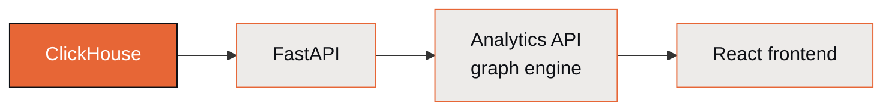

# Analytics API

The Analytics API is the relationship-graph query engine underneath ClickSpot. It's what
powers linked selections in the [Data Explorer](data-explorer.md), propagating a selection
across tables through the silver bridge tables, and it serves the React frontend directly.

## What it does

- **Graph queries.** Resolves objects and their relationships across the 13 bridge edges in
  the silver layer, so a request for "this company's deals" becomes a graph traversal rather
  than a hand-written join.
- **Selection propagation.** A selection in one table narrows every connected table. This is
  the engine behind the explorer's linked selections.
- **Computed metrics.** Exposes the 22 computed metrics (rep performance, deal health,
  source attribution, pipeline snapshots) as queryable fields.

In total, ClickSpot exposes roughly 64 endpoints across analytics, chat, data, objects,
dashboards, conversations, and spaces. The analytics endpoints are the graph engine; the
rest serve the surfaces documented elsewhere in these guides.

## Where it fits

## Endpoint-level reference

This page is the conceptual overview. For request and response shapes, the metric registry,
and how selection propagation is implemented, see the [Backend](../backend.md) engineering
doc, which documents the routes against the code.

!!! note "A generated reference is on the roadmap, not in this page"
    FastAPI already produces an OpenAPI schema, so a full, always-accurate endpoint reference
    can be generated rather than hand-maintained. That's tracked separately so this page can
    stay a stable concept overview; hand-writing 60-plus endpoints here would drift out of
    date the moment the API changes.
