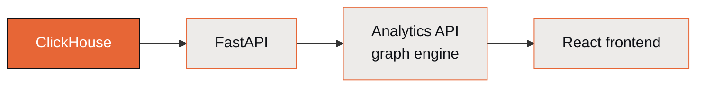

# Analytics API

The Analytics API is the relationship-graph query engine underneath ClickSpot. It's what
powers linked selections in the [Data Explorer](data-explorer.md) — cross-table selection
propagation through the silver bridge tables — and it serves the React frontend directly.

## What it does

- **Graph queries** — resolves objects and their relationships across the 13 bridge edges
  in the silver layer.
- **Selection propagation** — a selection in one table narrows every connected table.
- **Computed metrics** — exposes the 22 computed metrics (rep performance, deal health,
  source attribution, pipeline snapshots).

ClickSpot exposes roughly 64 API endpoints in total across analytics, chat, data, objects,
dashboards, conversations, and spaces.

## Where it fits

For endpoint-level detail — request/response shapes, the metric registry, and how selection
propagation is implemented — see the [Backend](../backend.md) engineering doc.

<!-- UXDesigner (CLI-118 follow-up): decide whether this stays a concept page or becomes a
referenced endpoint catalog. If we want a real API reference, that's a separate ticket
(consider generating from the FastAPI OpenAPI schema). Confirm scope with CTO. Run the
humanify skill on whatever prose ships. -->
