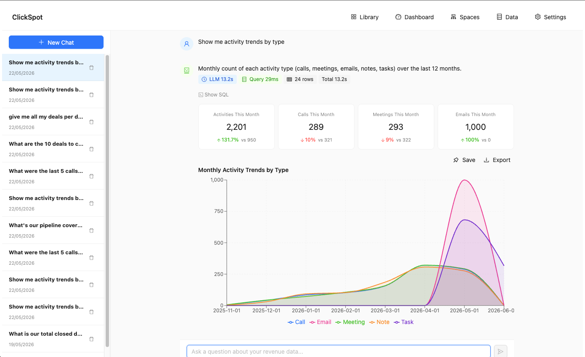

# Chat (NL → SQL)

Chat is the front door to ClickSpot. You ask a question in plain English; an LLM writes the
ClickHouse SQL, ClickSpot validates and runs it, and the answer comes back as a chart,
table, or number, with the generated SQL shown so you can check its work.

The model only ever sees your schema, not your rows. See [The privacy model](../concepts/privacy.md).

<figure markdown>
  { .shot }
  <figcaption>The chat home. Start from a blank prompt or one of the suggestions.</figcaption>
</figure>

## 1. Ask a question

Type a question in the box and send it. You don't need to mention table names or know the
schema; describe what you want in business terms ("open pipeline by rep this quarter") and
ClickSpot handles the translation.

Behind the scenes, ClickSpot builds a schema prompt (tables, types, and the business
context from your HubSpot properties), the LLM returns a structured response, and the result
renders inline:

```
User question
    -> Schema prompt (tables + semantics + business context)
    -> LLM (Claude / GPT-4o)
    -> Structured response {sql, viz, title, explanation, context}
    -> SQL validation (whitelist tables, block mutations)
    -> ClickHouse execution
    -> Chart / table / number rendered inline
```

<figure markdown>
  { .shot }
  <figcaption>A question answered with a multi-series trend chart and the SQL behind it.</figcaption>
</figure>

## 2. Read the answer

Every answer has three parts:

- **A visualization.** The model picks the shape that fits the question, from six types:
  number, table, bar, line, funnel, or comparison. A "what's our win rate" question comes
  back as a single number; "deals by stage" as a bar chart.
- **The SQL.** Open the SQL panel to read the exact ClickHouse query. It's there so you can
  sanity-check the logic, copy it, or reuse it elsewhere.
- **The explanation.** A short note on what the query did and any assumptions it made (which
  date field it used, how it defined "open", and so on).

Queries use relative date expressions (`today()`, `toStartOfMonth()`), so a saved answer
stays current as time moves; ask it in May and reopen it in June and the window has rolled
forward. Period-over-period questions come back with colored delta badges.

!!! tip "Check the SQL when a number surprises you"
    The explanation tells you the model's assumptions in words; the SQL tells you exactly
    what ran. If a figure looks off, the SQL panel is usually faster than re-asking.

## 3. Keep the thread going

Answers stack in a conversation, so you can refine instead of restarting. Ask a broad
question, see the shape of it, then narrow:

> *Which reps have the most open pipeline?*
> *Now just the EMEA team.*
> *Show that as a bar chart.*

Each follow-up is a fresh question with the previous thread as context, so you're never
re-typing the setup.

!!! note "Answers re-run, they don't cache rows"
    Chat history stores the query, not the result rows. Reopen an old answer and ClickSpot
    re-runs it against current data, so the numbers stay live. That's also why the privacy
    boundary holds: there's nothing to leak, because no rows were ever stored in the thread.

## 4. Good first questions

On the demo warehouse, try:

- *"Show me activity trends by type over the last 12 months."*
- *"Which reps have the most open pipeline?"*
- *"What's our win rate by deal source?"*
- *"What's our pipeline coverage for this quarter?"*

## 5. Save it and pin it

Found an answer worth keeping? Click **Save** under the result. It lands in the object
library (you'll see a "Saved to library" confirmation), where it's available to pin onto any
dashboard. Use the export buttons next to **Save** to pull a one-off result out as an image
or CSV.

From the library, pin the saved answer to a dashboard, where the global filters (date,
owner, pipeline) apply across every card at once. See [Dashboards](dashboards.md).
