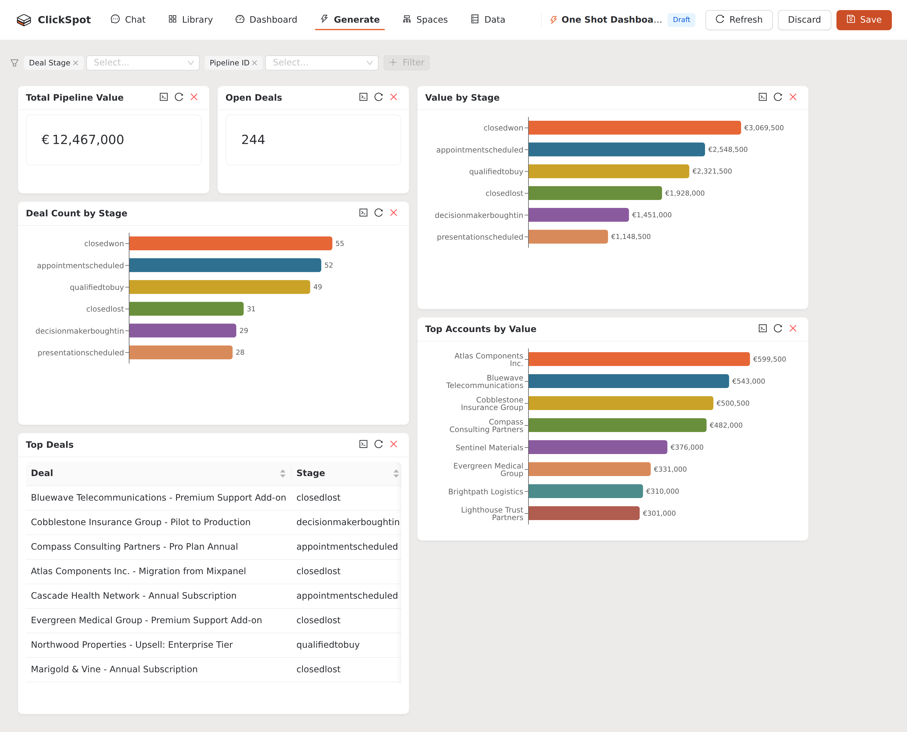
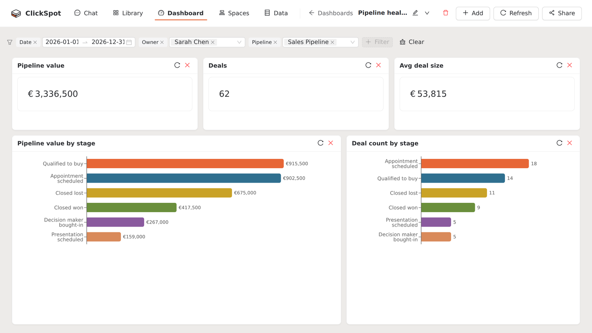

# Dashboards

Dashboards turn one-off questions into something persistent — a set of cards that stay put
and refresh against live data every time you open them. Generate a whole board from a single
prompt, or build one by hand from chat answers you've saved; either way the cards hold queries,
not snapshots, so the numbers stay current.

<figure markdown>
  { .shot }
  <figcaption>A deals dashboard. Pinned cards with year-to-date KPIs and breakdowns by stage.</figcaption>
</figure>

There are two ways to build one: describe it in a prompt and let ClickSpot generate the whole
board, or assemble it card by card from answers you've saved.

## Generate a dashboard from a prompt

The fast path: describe the dashboard you want in one prompt and ClickSpot builds the whole
thing — a set of complementary widgets, laid out and ready — instead of you pinning cards one
at a time.

**Where to start it.** The generator lives one click away from wherever you already are:

- **From the top navigation** — the **Generate** item (the :material-lightning-bolt: icon) opens
  the generator from anywhere in the app.
- **Inside a Data Space** — the **Generate** button sits in the header of a Space overview and
  its dashboard view. Starting here pre-selects that Space, so you go straight to the prompt.
- **From an empty state** — when a dashboards list or a Space dashboard has nothing in it yet,
  **Generate dashboard** is the primary call to action, alongside that surface's manual option
  (*New Dashboard* on the dashboards list, *Open Chat* on a Space). It's the fastest way to fill
  a blank board.

Then:

1. Pick the **Data Space** the dashboard should read from (already set if you came from one).
2. Describe your analysis case and the dashboard you want, in plain English — for example
   *"Sales pipeline health overview — headline KPIs, value by stage, trend over time, and top
   deals."* The more you say about the angle you care about, the closer the layout lands.
3. Click **Generate dashboard**.

**Watch it build.** There's no blank spinner — generation streams its progress. A bar reports
each stage as it happens: planning the dashboard, then building and validating the widgets
(*Building 6 widgets…*, then *Validated 3/6 widgets…*), so you can see the board taking shape.
Changed your
mind mid-run? **Cancel** stops it and drops you back at the prompt.

### What ClickSpot composes

Generation isn't a random pile of charts. The planner follows a composition grammar, so a
generated board reads like one a person would lay out:

- **One KPI band** of two to four headline numbers.
- **One time trend** when the data has a date to plot against.
- **Two to four breakdowns** — the bar and category charts that explain the KPIs.
- **At most one table** of detail rows.
- **A funnel** only when the data is a genuinely staged process (a pipeline), not forced onto
  anything else.

The layout is then keyed to each widget's role rather than the order it happened to generate
in: KPI tiles run across the top row, a wide trend chart (with a funnel beside it when there is
one) sits below, breakdowns pair up two to a row, and any detail table spans the full width at
the bottom. Every row fills the grid, so there are no ragged gaps — and you can still drag or
resize any tile to override the arrangement.

### Preview and iterate

**Preview before you commit.** The result lands as a **Draft** (a blue *Draft* tag sits in the
header) — a full preview grid of live widgets, with nothing saved yet. It behaves like a real
dashboard: drag and resize tiles, apply the global filter bar (covered below), and work each
card until the board is right.

Every card carries its own controls in the top-right corner:

- **Regenerate with AI** (:material-lightning-bolt:) — rebuild just that widget. Add an optional
  instruction to steer it (*"make this monthly"*, *"only closed-won deals"*) and ClickSpot
  rewrites the query in place.
- **View / edit SQL** (`</>`) — open the widget's query, edit it by hand, and **Run** to
  re-execute, or **Cancel** to revert.
- **Refresh** — re-run the query against current data.
- **Remove from draft** — drop a widget you don't want.

**Add another.** An *Add a widget* box sits under the grid — type a question
(*"Win rate by sales rep this quarter"*) and **Add widget** generates one more card into the
board.

**Recover failed widgets.** If a query fails validation, its card says so instead of rendering
empty, and a banner at the top counts the damage — *"2 of 6 widgets failed to generate"*. Hit
**Repair all failed** to have ClickSpot regenerate every broken widget in one go (you'll get a
tally of what it fixed and what still needs a look), or open each one and fix the SQL yourself.

<figure markdown>
  { .shot }
  <figcaption>One Shot Dashboard. A single prompt generates a full preview grid; refine each card, then keep it with <strong>Save</strong> or throw the draft away with <strong>Discard</strong>.</figcaption>
</figure>

### Save or discard

- **Save** names the dashboard and promotes the whole draft into your Data Space in one step —
  every widget's SQL, chart type, layout, and the active filters carried over — then drops you
  on the saved board, where it's a first-class dashboard like any other. If any widget is still
  failing, ClickSpot asks before it saves a broken card rather than losing the rest of the board.
- **Discard** throws the draft away. Because nothing was ever persisted, there's nothing to
  clean up — you land back at an empty prompt. (You're asked to confirm first, so a stray
  click can't lose a draft you meant to keep.)

!!! tip "An unsaved draft survives a reload"
    A draft lives only in your browser until you save it, so ClickSpot warns you before you
    reload or close the tab with one unsaved. And if you do come back to the prompt for the same
    Space, an **Unsaved draft found** banner offers to **Restore** the board where you left off
    (or **Dismiss** it to start fresh). One caveat: a draft that was still mid-generation can't
    be resumed — only a finished one is restorable.

!!! note "Generation is bounded"
    A generated dashboard is capped at a handful of widgets (a banner tells you if it hit the
    ceiling), and every widget's SQL goes through the same guardrails as [chat](chat.md):
    read-only, whitelisted tables, validated and dry-run before it renders, with one automatic
    repair attempt if a query fails. A draft is safe to generate and free to throw away.

## Build a dashboard by hand

Prefer to assemble a board yourself — or grow one a card at a time from questions you've
already asked? Build it manually.

### Create a dashboard

From the **Dashboards** page, create a new dashboard and give it a name (a deal name like
"Pipeline health" or "EMEA revenue" beats "Dashboard 1" when you have a few). It opens
empty, ready for cards.

### Pin cards to it

Cards come from saved chat answers, so the flow starts in [chat](chat.md):

1. Ask a question and click **Save** to put the answer in the object library.
2. On the dashboard, add a card and pick that saved object from the library.
3. Drag it on the grid to size and position it.

Repeat for each metric you want side by side. A card holds the query, not a snapshot, so
every card re-runs against current data on load.

## Read the "why" behind any card

Whether a card was generated or pinned by hand, its query and its intent travel with it on the
saved board:

- **Hover the card title** to see the business question the widget answers — the plain-English
  intent it was built from. On a generated board that's the reasoning the planner started from;
  on a hand-built card it's the question you asked in chat.
- **View SQL** (the `</>` button in the card's corner) reveals the exact query behind the
  numbers, so anyone reading the dashboard can check what it actually measures — and edit it
  where the card allows.

This is how a generated dashboard stays legible months later: the "what" is the chart, the
"why" is one hover away.

## Filter the whole board at once

Each dashboard has a global filter bar across the top. Its controls are drawn from the Data
Space the board reads from — typically a **date range** plus a couple of categoricals like
**owner** or **pipeline**. Set a filter and every card updates together, so you can read a KPI
tile and its supporting breakdowns through the same lens.

<figure markdown>
  { .shot }
  <figcaption>The filter bar in use — date, owner, and pipeline applied at once. Every card re-runs through the same lens.</figcaption>
</figure>

On a **generated** board, ClickSpot picks the filters for you. When the planner's suggested
filters map cleanly onto real columns in the Space, those are what you get. When they don't, it
falls back to a sensible default set — at most six columns, date and time columns first (as
range filters), then low-cardinality categoricals — and deliberately skips identifiers and raw
numeric measures, which make poor pick-from-a-list filters. The result is a filter bar you'd
actually use, not every column dumped into the header.

There's no AI at query time. Filters are applied by rewriting the SQL of each card directly:

```
Dashboard filter state
    -> sqlglot AST parse (ClickHouse dialect)
    -> Identify table references from a static registry
    -> Inject WHERE conditions (silver uses IDs, gold uses names)
    -> Re-execute all card queries
```

Because filtering is rule-based SQL rewriting and not a fresh LLM call, it's fast and
deterministic: the same filter state always produces the same query. Clear the filters to
return every card to its unfiltered view.

!!! tip "Filters live in the URL"
    The active filter state is encoded in the dashboard URL, so a filtered view is
    shareable and bookmarkable. Send someone "Q2, EMEA pipeline" and they land on exactly
    that, no setup required.

## Edit and rearrange

Dashboards aren't fixed once built. Rearrange the grid by dragging cards, resize them to
give the important number more room, and remove a card you no longer need. The layout is
saved per dashboard, so the arrangement you set is the one everyone sees.

## Where to go next

- Scope a dashboard (and its filters) to one team or pipeline with a
  [Data Space](../concepts/data-spaces.md).
- Build the underlying answers in [chat](chat.md).
