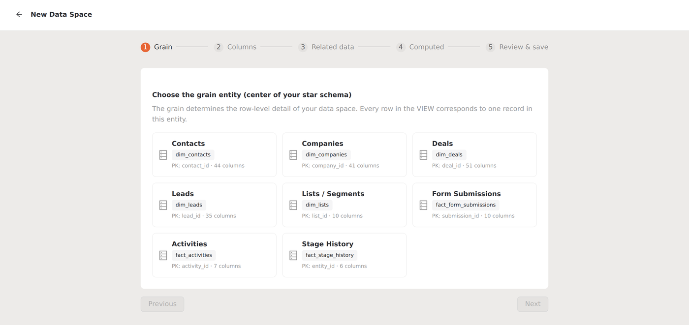
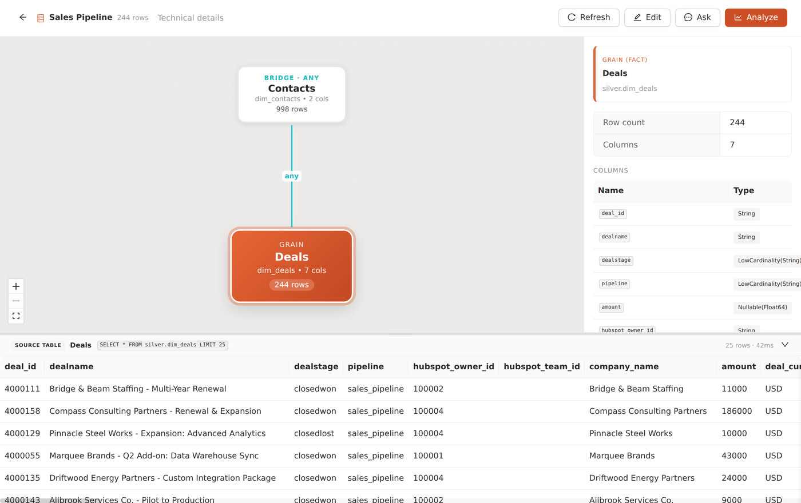
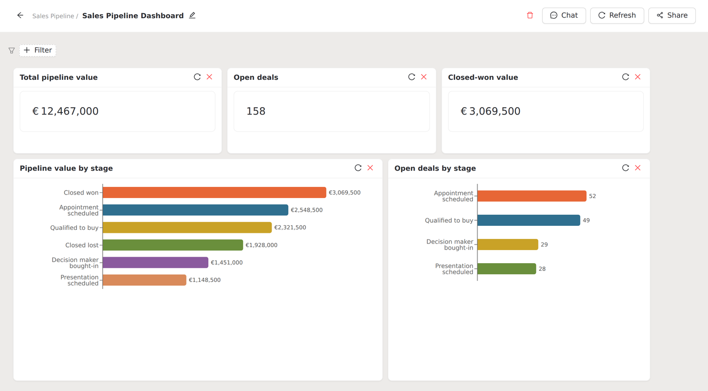

# Working with Data Spaces

A [Data Space](../concepts/data-spaces.md) is a scoped view over the warehouse with its own
chat, dashboards, and filters. This guide walks through creating one, configuring its scope
in the designer, and working inside it.

## 1. Create a space

From the **Data Spaces** list, start a new space. Give it a display name; the URL-safe ID is
derived from the name automatically, and you can override it before saving. Naming it for
the slice it covers ("EMEA Sales", "Renewals") keeps the space switcher readable once you
have a few.

## 2. Configure the scope in the designer

The designer is a five-step wizard. Each step narrows what the space contains:

<figure markdown>
  { .shot }
  <figcaption>Step 1 of the designer. The grain entity defines what one row in the space means.</figcaption>
</figure>

1. **Grain.** Pick the primary entity the space is built around (deals, contacts,
   companies). This sets what "one row" means inside the space, and an optional filter here
   defines the slice (for example, deals in the EMEA pipeline only).
2. **Columns.** Choose which columns from the grain entity the space exposes. Leave out the
   noise so chat and dashboards inside the space see a focused table.
3. **Related data.** Bring in connected objects through the relationship graph, so the
   space's linked selections and queries can reach contacts, owners, and stages off the
   grain entity.
4. **Computed.** Add computed metrics (win rate, pipeline coverage, and the rest of the
   registry) so they're available as first-class fields inside the space.
5. **Review & save.** Confirm the scope, set the space-wide default filter, and save.

The default filter is a space-wide policy: it's applied to everything in the space unless a
dashboard or question overrides it, so a space scoped to "this fiscal year, EMEA" stays that
way by default.

## 3. Use the space

Once saved, a space behaves like a focused copy of ClickSpot:

<figure markdown>
  { .shot }
  <figcaption>A saved space's overview — its grain, related data, and live row counts in one view.</figcaption>
</figure>

- **Chat** answers questions within the space's scope, against the columns and related data
  you exposed.
- **Dashboards** belong to the space and respect its filters; pin space chat answers the
  same way you would on a top-level dashboard.
- **Filters** (date, owner, pipeline) refine the slice further, on top of the space's
  default.

<figure markdown>
  { .shot }
  <figcaption>A dashboard inside a space. The cards are scoped to the space and respect its filters.</figcaption>
</figure>

Switch between the full warehouse and any space from the app navigation. Each space keeps
its own conversation history and dashboards, so two teams can work in parallel without
stepping on each other.

## Edit or refine later

A space's scope isn't locked once saved. Reopen it in the designer to add a column, widen
the grain filter, or pull in another related object as the team's needs change.

## Where to go next

- The concept and the reasoning behind spaces: [Data Spaces](../concepts/data-spaces.md).
- The relationship graph that powers a space's related data:
  [Data Explorer](data-explorer.md).
