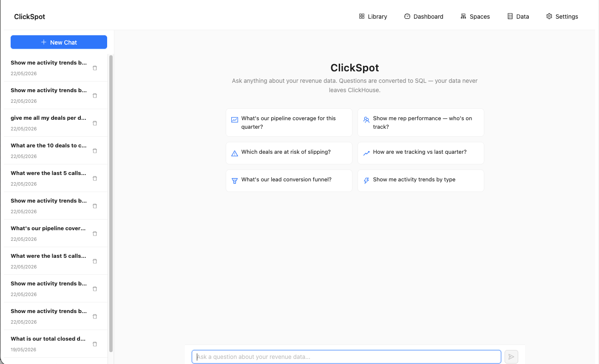
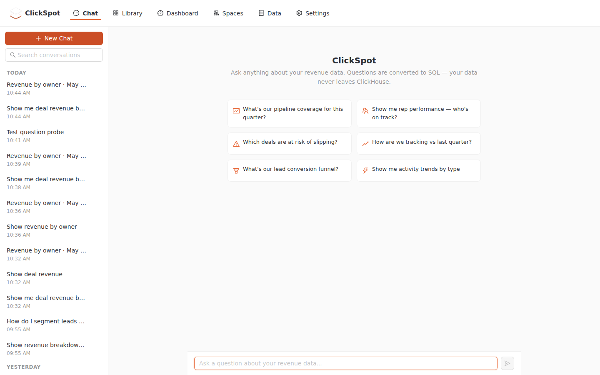
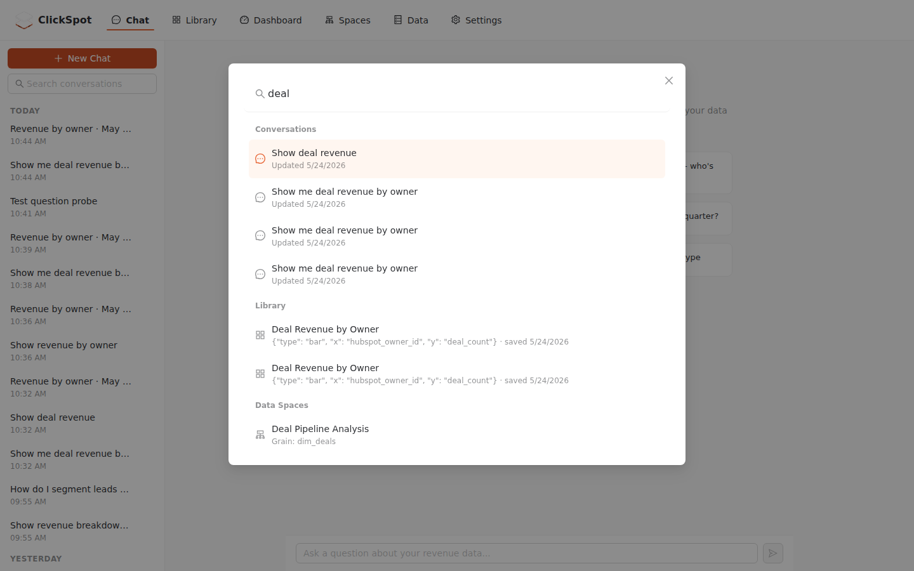
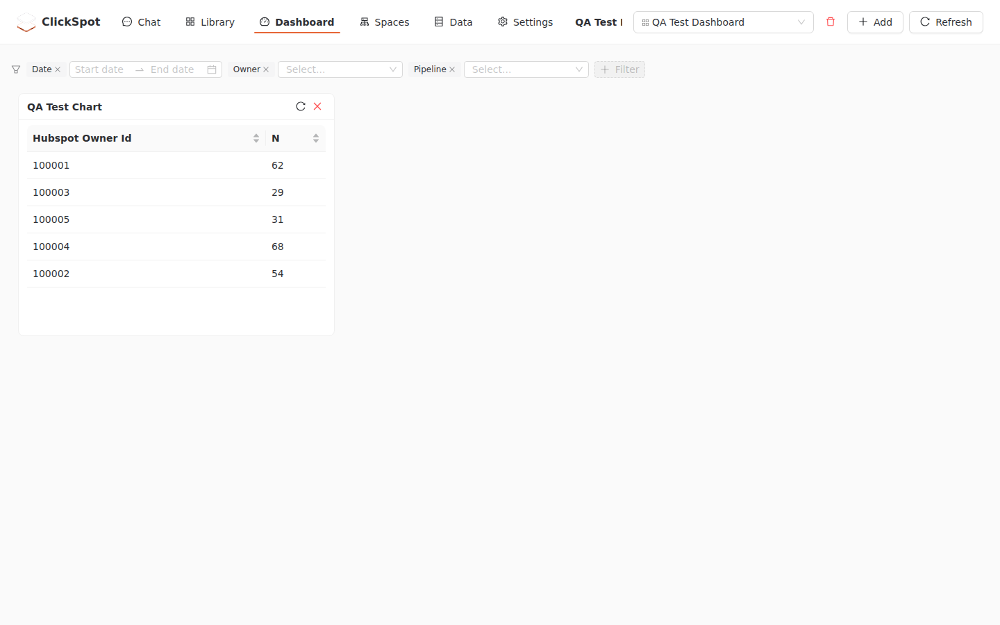
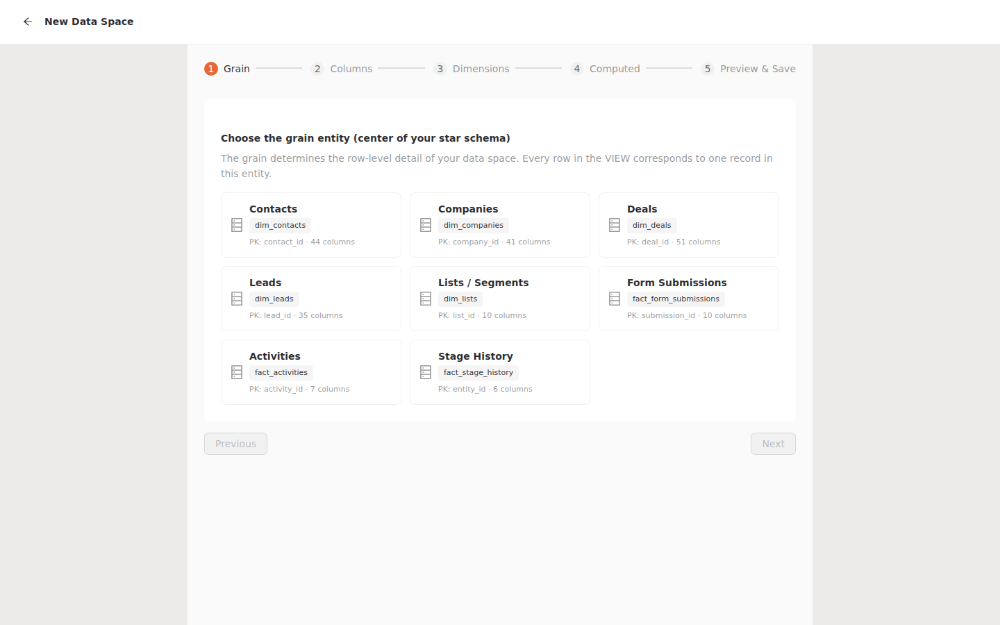
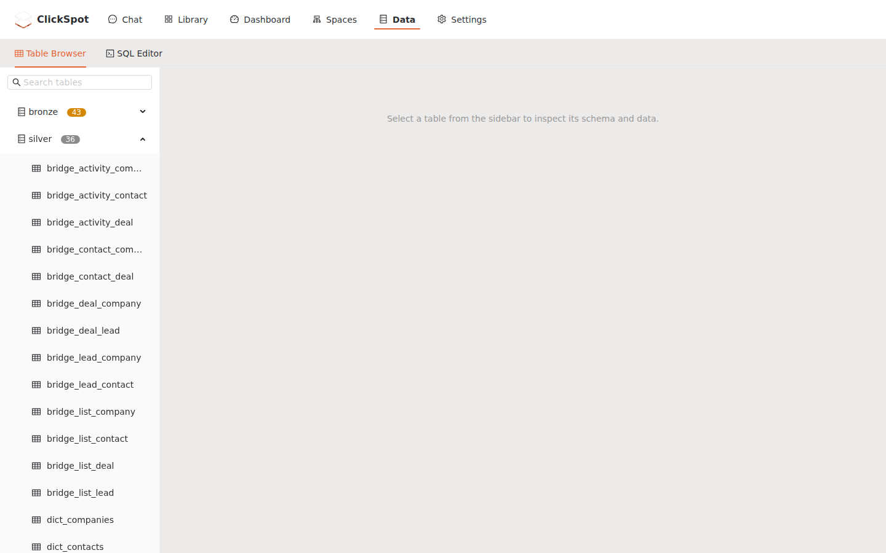
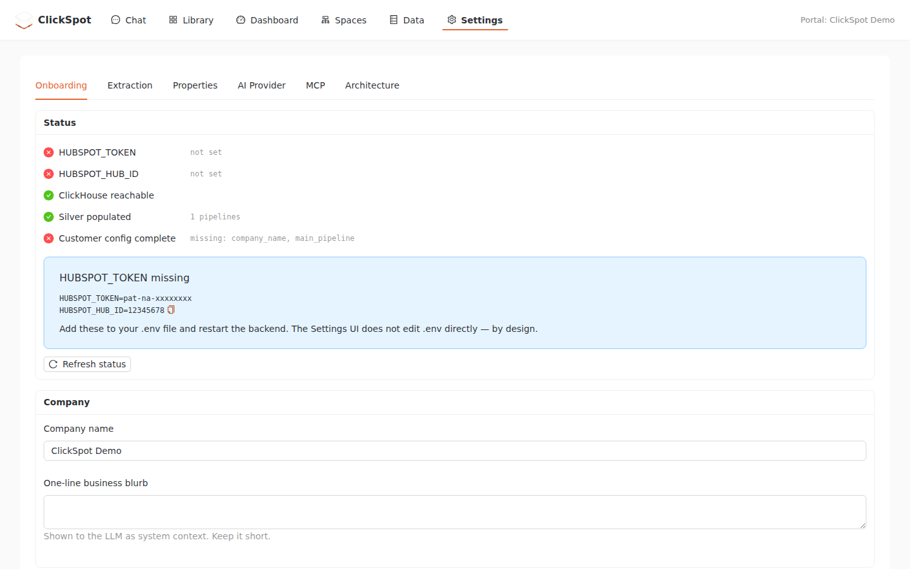
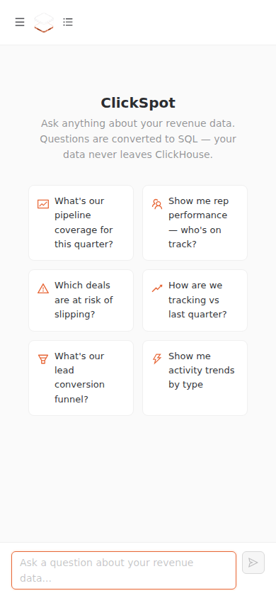

# ClickSpot UI Overhaul

ClickSpot's interface started as a working-but-prototypical Ant Design app: capable underneath, but visually unfinished and inconsistent. This overhaul (tracked in CLI-37) turned it into a coherent, branded product without rebuilding the foundations — same React 19 + Ant Design v6 + Recharts + React Flow stack, now sitting on a real design system.

The work was evaluated jobs-to-be-done first: what is each surface *for*, and where does it fail the user? Two patterns drove the plan — the app had **no design-system layer** (so nothing felt intentional), and it was **strong at authoring but weak at retrieval** (you could build things but not easily find them again). Everything below addresses one of those.

> Screenshots are at desktop **1440×900** unless noted. "Before" images are the pre-overhaul UI; "after" images are the shipped result on `main`.

---

## 1. A real design system (the root fix)

**Before:** there was no theme layer at all — `index.css` was four lines, no Ant `ConfigProvider`, and the framework's default blue `#1677ff` was hardcoded across 25+ files. ClickSpot's own coral brand appeared nowhere in the app.

**After:** a single token layer (`frontend/src/theme/`) wraps the app in a `ConfigProvider`. ClickSpot coral `#e76636` is the primary accent, on AA-contrast-checked neutrals, with one shared chart palette. Coral is used as an *accent* — primary actions, active states, focus — while neutrals still carry the surfaces.

| Before | After |
| --- | --- |
|  |  |

Notice in the "after": the coral brand mark, the **active-state nav** (you can finally tell which section you're in), coral primary buttons and input focus — and the redesigned conversation sidebar covered in §3.

_Tickets: CLI-38 (tokens + ConfigProvider, AA-clean coral)._

---

## 2. Search & retrieval — a global command palette

**Before:** search existed only where you *configured* things; the places you *return to* — conversation history, the saved Library, the table browser, the add-filter column picker — were all unsearchable lists.

**After:** a global command palette (**⌘K / Ctrl-K**) spans conversations, saved objects, data spaces, tables, and settings, plus in-list search on the Library and table/column browser.

_Tickets: CLI-39 (global + in-list search), CLI-48 (palette keyboard-nav fix)._

---

## 3. Conversation history that scales

**Before:** a flat, unsearchable list of near-identical truncated titles, with a one-click delete that had no confirmation (easy accidental data loss).

**After:** conversations are **grouped by date** (Today / Yesterday / Last 7 days), there's a **search box**, titles are meaningful, and delete is a safe, hover-revealed action. See the sidebar in the §1 "after" image.

_Tickets: CLI-41 (group, search, safe delete); follow-up CLI-55 (date suffix + matched-text snippet)._

---

## 4. One filter system, shareable

**Before:** three different filter implementations with divergent UX, and filtered views couldn't be shared (no URL state).

**After:** a single type-aware filter bar (date ranges, numeric operators, searchable multi-selects) is used everywhere, and **filter state lives in the URL** — copy the link and you reproduce the exact filtered view.

| Before | After |
| --- | --- |
|  |  |

_Tickets: CLI-40 (unify filters + URL state), CLI-58 (shareable dashboard links)._

---

## 5. Chat you can trust

**Before:** the result view prominently showed raw latency chips (`LLM 13.2s · Total 13.2s`) and a blank wait while generating; a `+100% vs 0` divide-by-zero appeared in KPI deltas.

**After:** generation shows progress, the latency detail is demoted behind a popover, the zero-baseline delta renders sensibly, and the nav gained active state + the brand mark.

_Tickets: CLI-42 (chat progress + latency demote + KPI delta fix + active-state nav)._

---

## 6. Data Spaces without writing SQL

**Before:** the Data Space designer — a genuinely powerful semantic-layer builder — forced raw ClickHouse SQL at three points (freeform `WHERE`, computed expressions, and a user-typed ID that leaked into the physical `gold.ds_{id}` view name). That broke the product's "ask in plain language, no SQL" promise the moment you left chat.

**After:** the same filter-builder from §4 is the default for grain/space filters (raw SQL kept as an opt-in advanced escape hatch), the Space ID auto-generates, and there are computed-column presets. A "chat with this space" bridge is surfaced.

_Tickets: CLI-43 / CLI-61 (no-SQL designer — filter builder + presets + chat bridge), CLI-64 (mobile label ellipsis)._

---

## 7. Phase-4 round-off

**Dashboard / Explorer polish** — tokenised cards, a legend for the property-tag taxonomy (`locked-core / core / extra / …`), and schema-table search + density control (CLI-57).

| Data Explorer — before | Data Explorer — after |
| --- | --- |
|  |  |

**First-run onboarding checklist** — the Settings → Onboarding tab now shows a live setup status checklist so a new operator can see exactly what's connected (CLI-59).

**Read-only mobile** — dashboards and chat render without horizontal overflow on small screens (CLI-60).

**Shareable dashboards** — share links built on the URL-persisted filters (CLI-58). A dashboard white-screen bug surfaced during QA and was fixed with a route error boundary (CLI-63).

---

## What's intentionally not here

- **Role/auth (user vs admin).** ClickSpot has no permission model today, and adding one is a product + security decision rather than UI polish — deliberately deferred, not forgotten.
- **Non-blocking polish** tracked separately: chart colour-blindness audit (CLI-45), tokenised medallion tier colours (CLI-46), dashboard CSV/PNG export (CLI-67).

---

*Delivered under [CLI-37 “Propose UI Overhaul”]. Generated screenshots reflect the shipped `main` build against seeded demo data.*
